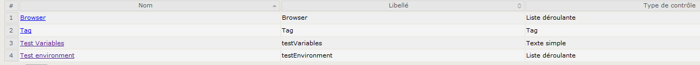
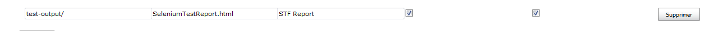

## SeleniumRobot Features ##
### Test script configuration handling ###
#### XML configuration ####
XML testing file handles many technical configurations: server address, used tools and related configuration.
 
Business configuration can be done through the “unknown” parameters. These are parameters which are not known from the framework. They are added to a list of business parameters.

#### Confg.ini configuration ####
XML configurations are done statically and must be duplicated through all the test suites (or using “testConfiguration” parameter). It’s not possible to have a centralized configuration which depends on test environment.

*Example:* the server URL depends on testing phase. They are not the same in production and in integration phase.

That’s why the “config.ini” file is made for. Each tested application can embed a config.ini file whose format is: 

 
“General“ section is for common configuration (e.g: a database user name which does not depends on environment) and other sections are specific to named test environments. Here, we define a “Dev” environment. Then, when launching test, user MUST define the environment on which test will be run with the option `-Denv=Dev`

Keys defined in environment sections override the ones in “General” section.
This file must be located in <application root>/data/<application name>/config folder.

#### Using configurations in test scripts ####
Each webpage can use the configurations defined above using (getting variable “text” from configuration):

 
### Cucumber tests ###
TBC

### TestNG tests ###
**TBD (extract example from qwantTest)**

# Test with providers #
## Test with Appium locally ##
### Application test on android ###

    <test name="tnr_appium_mobile_app" parallel="false">
    
    	<!-- cucumber part -->
    	<parameter name="cucumberTests" value="Infolidays" />
    	<parameter name="cucumberTags" value="" />
    	
    	<parameter name="browser" value="*android" />
    	<parameter name="testType" value="appium_app_android" />
    	<parameter name="appiumServerURL" value="http://localhost:4723/wd/hub"/>
    	<parameter name="platform" value="Android 6.0"/>
    	<parameter name="deviceName" value="192.168.56.101:5555"/>
    
    	<parameter name="app" value="C:\Users\behe\Documents\Tests\Tests mobiles\infolidays-1.0.0-release.apk"/>
    	<parameter name="appPackage" value="com.infotel.mobile.infolidays"/>
    	<parameter name="appActivity" value="com.infotel.mobile.mesconges.view.activity.StartActivity"/>
    	<parameter name="newCommandTimeout" value="120"/>
    
    	<packages>
    		<package name="com.seleniumtests.core.runner.*"/>
    	</packages>
    </test>

deviceName reflects the local device used to automate the test

## Test with SauceLabs ##

## Test with Testdroid ##

# Configurations #
Below is the list of all parameters accepted in testing xml file.
**TBD**

# Interfacing with tests managers #
## Squash TM/TA ##
STF can work with Squash TA by using an intermediate .java file. This file handles:

- Execution of test framework using a command line
- Generation of .ta files
- Update of test list

### Execution of test framework ###
This needs some environment variable configuration:
- Add a STF_HOME environment variable pointing to the folder where STF is deployed
- Add a JAVA_HOME_STF environment variable pointing to a Java 8 installation. This is mandatory as for now (Squash TA 1.9), Squash only supports Java 7 whereas STF is built using Java 8.

**Execution platform must be installed with Java 8**

A typical command line would be:

    %JAVA_HOME_STF%/bin/java -cp %STF_HOME%/seleniumtestsframework.jar;%STF_HOME%/plugins/${application}-tests.jar -Dbrowser=${TC_CUF_browser} -DcucumberTests=\"${TC_CUF_cucumberTest}\" -DcucumberTags=${TC_CUF_cucumberTags} -Dvariables=${TC_CUF_testVariables} -Denv=${TC_CUF_testEnvironment} org.testng.TestNG ${testngFile} -testnames ${testngName}
Each ${} is a variable passed by the .ta script when replacing variables by their actual value.
### Squash TM configuration ###
Launching of STF expects some variables passed to the script. These MUST be declared on Squash TM side (as Test Case custom fields or Test Execution custom field):

- browser
- testEnvironment

**Make sure your .ta script reflects this choice**
 
### TA files generation ###
Before each run, test script updates the list of .ta files so that they reflect the list of available Cucumber Scenario and/or TestNG tests. The generation can also be done launching the Jenkins job with the following parameters:

 
Generation is done using a root test file names src/Squash ta/tests/<application>_generic.ta where some fields will be replaced to reflect the cucumberTest, TestNG xml file name and TestNG test name.

#### Cucumber mode ####
A .ta test script will be generated for each cucumber scenario combined with each TestNG test. When launching this type of .ta script, cucumber variables contained in the testNG.xml file will be overridden.

If some of the scenarios should not be available through Squash TA: precede them with the tag 

    @EXCLUDE_FROM_SQUASH_TA

 
#### TestNG mode ####
A .ta test script will be generated for each TestNG test.
Below is an example of what has been generated for cucumber scenarios.

 
If some of the tests should not be available in Squash TA, precede them with the comment: 

    <!-- EXCLUDE_FROM_SQUASH_TA -->

 
### Squash TA job configuration ###
By default, Squash TM receives the Squash TA test report. But, it’s useless when executing tests with STF as it does not contain any details. So we have to configure the STF report to be sent to Squash TM
Add the following line below « Publish HTML reports »

 
In maven command line (goals & options), replace

    -Dta.tmcallback.reportname= Squash_TA_HTML_Report
by

    -Dta.tmcallback.reportname=STF_Report

