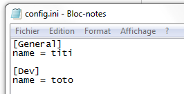
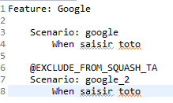

# SeleniumRobot documentation #

## Introduction ##
SeleniumRobot is a test framework based on Selenium & Appium API to ease Web and Mobile testing. It's based on the seleniumtestsframework open-source project [https://github.com/tarun3kumar/seleniumtestsframework](https://github.com/tarun3kumar/seleniumtestsframework)

Main features are:

- Test using browsers (Desktop & Mobile)
	- Firefox
	- Chrome
	- Internet Explorer
	- Safari
	- Opera
	- HTMLUnit (a headless browser)
- Test of mobile applications on
	- Android
	- iOS
- Tests in
	- Local (on current computer)
	- Using SeleniumGrid
	- SauceLabs environment
	- Testdroid environment
- Snapshot on steps
- HTML & xUnit report
- Gherkin / Cucumber compatibility
- Replay on failure
- Selenium error recovery

## Installation ##

### Development environment ###
SeleniumRobot is developped using eclipse IDE. Following plugins are mandatory:

- aspectj plugin (AJDT): use the dev version are older versions are not compatible with recent eclipse versions
- m2e plugin (maven)
- subeclipse (if using SVN for test application)
- TestNG (execute testNG tests)

SeleniumRobot needs Java 8 to be compiled.

#### Sign artifact for deploy phase ####
OSS needs artifacts to be signed before being deployed
Therefore, generated a GPG key (it will ask a name and a password)

	gpg --gen-key

Copy key to a public key server

	gpg2 --keyserver hkp://pgp.mit.edu --send-key <key_name>

#### Git key for release ####
In order for maven to push tags on release, a key must be generated for SSH connection

    ssh-keygen -t rsa -C '<key name>’
Copy the generated public key to Github
Check connection (it should reply: You've successfuly authenticated)

    ssh git@github.com

#### Maven configuration ####
Maven 3 is required

Following configurations should be placed in user `settings.xml` file:

For GPG

	<profile>
		<id>gpg</id>
		<activation>
			<activeByDefault>true</activeByDefault>
		</activation>
      <properties>
        <gpg.executable>gpg2</gpg.executable>
        <gpg.passphrase><your key password></gpg.passphrase>
      </properties>
    </profile>

For Sonar analysis

	<profile>
		<id>sonar</id>
		<activation>
			<activeByDefault>true</activeByDefault>
		</activation>
		<properties>
			<sonar.host.url>http://server:9000</sonar.host.url>
		</properties>
	</profile>

For publishing artifacts to OSS Sonatype server

	<server>
      <id>ossrh</id>
      <username><your_user></username>
      <password><your_password></password>
    </server>

### Execution environment ###
Execution environment needs at least Java 8. SeleniumRobot is compatible with Windows, Mac OS and Linux.
Depending on your tests, you should consider install:

- A browser 
- Appium
- Android SDK / Genymotion to test on android simulator / emulator
- XCode (Mac OS X) to test on iPhone Simulator 

## Test writting ##

### Create a new test application ###
A "test application" is the code specific to the Web or Mobile application under test. It consists of testNG files, Cucumber feature files, configurations and Java implementation files.

Use seleniumRobot-example project as a base to develop your own test application
[https://github.com/bhecquet/seleniumRobot-example](https://github.com/bhecquet/seleniumRobot-example)

#### Requirements are ####

- Test data are in `data/<app_name>/`
	- `features` contains feature files (mandatory if cucumber mode is used)
	- `testng` contains testng files to start tests (mandatory)
	- `config` contains centralized env test configuration (optional)
	- `squash-ta` contains ta files that should override the default ones (optional). See Squash-TA section for details 

- Test code must be in `src/test/java`
- package name is free but following structure should be used
	- `cucumber` subpackage contains cucumber implementation files. As cucumber annotations can be written directly in test page object, it should at least contain code for `@Then` (checks) and `@Given` (initial state).
If pure TestNG mode is used, this package should not exist.
	- `tests` subpackage contains code for pure TestNG tests (not cucumber). If cucumber mode is used, this package should not exist
	- `webpage` subpackage is mandatory as it contains PageObject implementation

### PageObject ###
PageObject is a design pattern that helps writing maintainable selenium applications. Each screen of the website or mobile application is a class.
This class contains:

- fields which are the elements on the page
	- links
	- buttons
	- text fields
	- ...
- methods which are the available actions in the page
	- validate form
	- fill form
	- access an other page

Example of a shopping cart class:

	public class ShoppingCart extends HeaderAndFooter {
	
		private static LinkElement proceed = new LinkElement("Checkout", By.linkText("Proceed to Checkout"));
		private static LinkElement updateCart = new LinkElement("updateCart", By.name("updateCartQuantities"));
		private static Table cart = new Table("cart", By.tagName("table"));
	
		public ShoppingCart() throws Exception {
			super(proceed);
		}
		
		public ShoppingCart changeQuantity(String item, String newQuantity) {
			new TextFieldElement("quantity", By.name(item)).sendKeys(newQuantity);
			updateCart.click();
			return this;
		}
		
		public String getTotalAmount() {
			String amount = cart.getContent(cart.getRowCount() - 1, 0).replace("Sub Total: $", "");
			return amount;
		}
		
		public SignIn checkout() throws Exception {
			proceed.click();
			return new SignIn(); 
		}
		
		public PaymentDetails checkoutSignedIn() throws Exception {
			proceed.click();
			return new PaymentDetails(); 
		} 
	}
	
**WARN:** If you write your class combined with cucumber feature (methods annotated with @Given, @When, ...), only write methods returning `void`. Else, report will contain new page create step twice.

### Write a test ###
A test is a suite of steps defined in several page objects. By convention, they are located in the `tests` folder
Assuming that the right objects are created, a test looks like:
    
    public class VmoeTests extends SeleniumTestPlan {
	
		@Test(
		        groups = { "vmoe" },
		        description = "check Angel Fish"
		    )
		public void consultProductDetails() throws Exception {
			ProductItem productItem = new JPetStoreHome(true)
				.goToFish()
				.accessAngelFish()
				.showItem("EST-1");
			Assert.assertEquals(productItem.getProductDetails().name, "Large Angelfish");
		}
	}

A typical method whould be

	public FishList goToFish() throws Exception {
    	fishMenu.click();
    	return new FishList();
    }

#### TestNG file ####
For tests extending SeleniumTestPlan, the testNg XML looks like (minimal requirements):
	<suite name="Integration tests" parallel="false" verbose="1" thread-count="1">
	    <listeners>
	        <listener class-name="com.seleniumtests.reporter.SeleniumTestsReporter" />
	        <listener class-name="com.seleniumtests.core.testretry.TestRetryListener" />
	    </listeners>

	    <test name="order">	    	
	        <classes>
	            <class name="com.infotel.seleniumRobot.jpetstore.tests.VmoeTests">
	            	<methods>
	            		<include name="orderFish" />
	            	</methods>
	            </class>
	        </classes>
	    </test>
	</suite>

### Write a cucumber test ###
Cucumber styled tests rely on a `.feature` file where each test step is defined. Look at [https://cucumber.io/docs/reference](https://cucumber.io/docs/reference) for more information about writing a feature file.

Each line in the feature file must correspond to an implementation inside java code through annotation

	@When("Cliquer sur le lien 'FISH'")
    public void goToFish() throws Exception {
    	fishMenu.click();
    }

**WARN:**You should write only void methods to avoid getting twice the page creation in report

#### Feature file example ####
	Feature: Catalogue
	
		Scenario: Consulter la fiche Angel Fish
			
			Given Ouvrir le jPetStore
			When Cliquer sur le lien 'FISH'
			And Cliquer sur le produit 'Angel Fish'
			And Cliquer sur le type 'EST-1'
			Then Le nom du produit est 'Large Angelfish'

#### TestNG file ####
XML testNg file looks like:
	<!DOCTYPE suite SYSTEM "http://beust.com/testng/testng-1.0.dtd" >
	<suite name="Integration tests" parallel="false" verbose="1" thread-count="1">
	    <listeners>
	        <listener class-name="com.seleniumtests.reporter.SeleniumTestsReporter" />
	        <listener class-name="com.seleniumtests.core.testretry.TestRetryListener" />
	    </listeners>
	
		<parameter name="cucumberPackage" value="com.infotel.seleniumRobot.jpetstore" />
	    
	    <test name="consult_catalog">
	    	<parameter name="cucumberTests" value="Consulter la fiche Angel Fish" />
		    <parameter name="cucumberTags" value="" />
	    	
	        <packages>
	            <package name="com.seleniumtests.core.runner.*"/>
	        </packages>
	    </test>
	   
	</suite>

`cucumberPackage` parameter is mandatory so that framework knows where implementation code resides

### Configure test scripts ###
There are several ways to make values in test script change according to test environment, executed test, ...

#### XML configuration ####
XML testing file handles many technical configurations: server address, used tools and related configuration.
 
Business configuration can be done through the “unknown” parameters. These are parameters which are not known from the framework. They are added to a list of business parameters.

#### Confg.ini configuration ####
XML configurations are done statically and must be duplicated through all the test suites (or using “testConfiguration” parameter). It’s not possible to have a centralized configuration which depends on test environment.

*Example:* the server URL depends on testing phase. They are not the same in production and in integration phase.

That’s why the “env.ini” file is made for. Each tested application can embed a env.ini file whose format is: 

 
“General“ section is for common configuration (e.g: a database user name which does not depends on environment) and other sections are specific to named test environments. Here, we define a “Dev” environment. Then, when launching test, user MUST define the environment on which test will be run with the option `-Denv=Dev`

Keys defined in environment sections override the ones in “General” section.
This file must be located in "<<t>application root>/data/<<t>application name>/config" folder.

These configurations are also stored in the business configuration.

#### Using configurations (aka business configuration) in test scripts ####
Each webpage can use the configurations defined above using (getting variable “text” from configuration):

### Test script configuration mapping ###
#### Mapping files utility ####

Mapping file give possibility to call an element in a web page with a more accessible and understandable word. This way your code gain clarity for a non technical user.
Every element can be redefined for any platform and version, you just have to create a hierarchical architecture of files :
example :

#### objectMapping.ini configuration ####

Each file can define new elements, and it inherits parents files.
The structure of an objectMapping.ini file looks like that :

between [ ] you define the web page where to use the following definitions. Next, there is the word definitions : caller_word:technical_word

#### Mapping data use ####

In the corresponding pageObject you can use mapping words to search elements using : locateBy(map:caller_word) or by.(map:caller_word). It will search the element in the page which is defined by the technical word. 

## Run tests ##

### Configurations ###
Below is the list of all parameters accepted in testing xml file.

| Param name       			| Default 	| Description  |
| -------------------------	| ------- 	| ------------ |
| testConfig 				|  			| Additional configuration. This should contain common configuration through all TestNG files. See `exampleConfigGenericParams.xml` file for format | 

| webSessionTimeOut 		| 90000 	| browser session timeout in milliseconds | 
| implicitWaitTimeOut 		| 5			| implicit wait of the browser, in seconds (selenium definition) | 
| explicitWaitTimeOut 		| 15		| explicit wait of the browser, in seconds. Used when checking is an element is present and no wait value is defined (`waitElementPresent` & `isElementPresent` | 
| pageLoadTimeout 			| 90		| Value defined in selenium driver. Wait delay for page loading | 

| webDriverGrid 			| 			| Address of seleniumGrid server | 
| runMode 					| LOCAL		| `local`: current computer `grid`: seleniumGrid `sauceLabs`: run on sauceLabs device `testDroid`: run on testdroid device | 
| devMode 					| false		| The development mode allow all existing browsers to remain. In case test is run from any IDE, devMode will be defaulted to true | 
| browser 					| firefox	| Browser used to start test. Valid values are: `firefox`, `chrome`, `safari`, `iexplore`, `htmlunit`, `opera`, `phantomjs`, `none` for no driver, `browser` for android default browser | 
| browserVersion 			|  			| Browser version to use. By default, it's the last one, or the installed one in local mode. This option has sense when using sauceLabs where browser version can be choosen | 
| firefoxUserProfilePath 	|  			| Firefox user profile if a specific one is defined | 
| useFirefoxDefaultProfile	| true		| Use default firefox profile | 
| operaUserProfilePath 		| 			| Opera user profile if a specific one is defined | 
| firefoxBinaryPath 		| 			| Path to firefox binary if a specific one should be used (for example when using portable versions. Else, the default firefox installation is choosen | 
| chromeDriverPath 			| 			| Path to a different installation of chromedriver executable | 
| chromeBinaryPath 			| 			| Path to chrome binary if using a portable installation (not detected by system | 
| ieDriverPath 				| 			| Path to a different ieDriverServer executable | 
| userAgent 				| 			| Allow defining a specific user-agent in chrome and firefox only | 
| enableJavascript 			| true		| Javascript activation |
| browserDownloadDir 		| 			| Path where files are downloaded. Firefox only | 
| proxyType 				| AUTO		| Proxy type. Valid values are `AUTODETECT`, `MANUAL`, `DIRECT`, `PAC`, `SYSTEM` | 
| proxyAddress 				| 			| Proxy address, if MANUAL type is choosen | 
| proxyPort 				| 			| Proxy port, if MANUAL type is choosen | 
| proxyLogin 				| 			| Proxy login, if MANUAL type is choosen |  
| proxyPassword 			| 			| Proxy password, if MANUAL type is choosen | 
| proxyExclude 				|			| Proxy address exclusion, if MANUAL type is choosen | 
| proxyPac 					| 			| Automatic configuration address, if PAC type is choosen | 
| reportGenerationConfig 	| summaryPerSuite | Type of report generation.
| captureSnapshot 			| true 		| Capture page snapshots
| softAssertEnabled 		| true		| Test does not stop is an assertion fails. Only valid when using assertions defined in `CustomAssertion` class or assert methods in `BasePage` class | 
| outputDirectory 			| <exec folder>	| folder where HTML report will be written | 
| webDriverListener 		| 			| additional driver listener class |
| testMethodSignature 		|  			| define a specific method signature for hashcodes |
| pluginConfigPath 			|  			| plugins to add |
| testDataFile 				|  			| Datafile to read and inject inside tests | 
| cucumberTests 			|  			| List of tests to execute when using cucumber mode. Test name can be the feature name, the feature file name or the scenario name | 
| cucumberTags 				|  			| List of cucumber tags that will allow determining tests to execute. Format can be: `@new4 AND @new5` for filtering scenario containing tag new4 AND new5 `@new,@new2` for filtering scenarios containing new OR new2 `@new` for filtering scenario containing new tag | 
| env 						| DEV		| Test environment for the SUT. Allow accessing param values defined in env.ini file  
| cucumberPackage 			| 			| **Mandatory for cucumberTests:** name of the package where cucumber implementation class reside | 
| app 						| 			| Path to the application file (local or remote) | 
| appiumServerURL 			| 			| Appium server url. May be local or remote | 
| deviceName 				| 			| Name of the device to use for mobils tests | 
| appPackage 				| 			| Package name of application (android only) | 
| appActivity 				| 			| Activity started by mobile application (Android) | 
| appWaitActivity 			| 			| In some cases, the first started activity is not the main app activity | 
| newCommandTimeout 		| 120		| Max wait between 2 appium commands in seconds | 
| version 					| 			| Platform version | 
| platform 					| 			| platform on which test should execute. Ex: Windows 7, Android 5.0, iOS 9.1, Linux, OS X 10.10. Defaults to the current platform | 
| cloudApiKey 				| 			| Access key for service | 
| projectName 				| 			| Project name for Testdroid tests only | 

### Test with Appium locally ###
#### Application test on android ####

    <test name="tnr_appium_mobile_app" parallel="false">
    
    	<!-- cucumber part -->
    	<parameter name="cucumberTests" value="Infolidays" />
    	<parameter name="cucumberTags" value="" />
    	
    	<parameter name="browser" value="*android" />
    	<parameter name="testType" value="appium_app_android" />
    	<parameter name="appiumServerURL" value="http://localhost:4723/wd/hub"/>
    	<parameter name="platform" value="Android 6.0"/>
    	<parameter name="deviceName" value="192.168.56.101:5555"/>
    
    	<parameter name="app" value="C:\Users\behe\Documents\Tests\Tests mobiles\infolidays-1.0.0-release.apk"/>
    	<parameter name="appPackage" value="com.infotel.mobile.infolidays"/>
    	<parameter name="appActivity" value="com.infotel.mobile.mesconges.view.activity.StartActivity"/>
    	<parameter name="newCommandTimeout" value="120"/>
    
    	<packages>
    		<package name="com.seleniumtests.core.runner.*"/>
    	</packages>
    </test>

deviceName reflects the local device used to automate the test

### Test with SauceLabs ###
TBD

### Test with Testdroid ###
TBD

## Development ##

### Import project ###
eclipse project file is provided to avoid eclipse project configuration
Import this project into eclipse.

In case eclipse does not weave aspects (.aj files do not have the 'A' icon), check in build path parameters that **/*.aj files are included to "sources on build path)

### Build ###
Create build (for core and test apps):

	mvn clean package

Build creates a file named seleniumBot-core.zip. 

### Test ###
SeleniumRobot contains Unit tests, executed through the maven "test" phase. They tend to be quick and do not use any browser. They are configured using the `data/core/testng/tu.xml` file.

Integration tests are executed in the maven "verify" phase. They are configured using the `data/core/testng/ti.xml` file. These tests can start browser to check specific features.

### Deploy ###
Unzip this file to any folder.

Also unzip the test app and you should get this folder structure:

### Release code ###
When a SNAPSHOT version is ready to be released, use

    mvn release:prepare release:perform

Check installation requirements to perform a release

## Interfacing with tests managers ##
### Squash TM/TA ###
STF can work with Squash TA by using an intermediate .java file. This file handles:

- Execution of test framework using a command line
- Generation of .ta files
- Update of test list

#### Execution of test framework ####
This needs some environment variable configuration:

- Add a `STF_HOME` environment variable pointing to the folder where STF is deployed
- Add a `JAVA_HOME_STF` environment variable pointing to a Java 8 installation. This is mandatory as for now (Squash TA 1.9), Squash only supports Java 7 whereas STF is built using Java 8.

**Execution platform must be installed with Java 8**

A typical command line would be:

    %JAVA_HOME_STF%/bin/java -cp %STF_HOME%/seleniumtestsframework.jar;%STF_HOME%/plugins/${application}-tests.jar -Dbrowser=${TC_CUF_browser} -DcucumberTests=\"${TC_CUF_cucumberTest}\" -DcucumberTags=${TC_CUF_cucumberTags} -Dvariables=${TC_CUF_testVariables} -Denv=${TC_CUF_testEnvironment} org.testng.TestNG ${testngFile} -testnames ${testngName}
Each ${} is a variable passed by the .ta script when replacing variables by their actual value.
#### Squash TM configuration ####
Launching of STF expects some variables passed to the script. These MUST be declared on Squash TM side (as Test Case custom fields or Test Execution custom field):

- browser
- testEnvironment

**Make sure your .ta script reflects this choice**
 
#### TA files generation ####
Squash TM needs a list of .ta files to detect which test scripts are available.
These .ta files can be written manually but, as they all use the same format, they can also be generated when building test application. To allow this generation, add the following in pom.xml of the test applications.

    <plugin>
		<groupId>org.codehaus.mojo</groupId>
		<artifactId>exec-maven-plugin</artifactId>
		<version>1.5.0</version>
		<executions>
			<execution>
				<id>squash-ta-generator</id>
				<phase>generate-sources</phase>
				<goals>
					<goal>java</goal>
				</goals>
				<configuration>
					<mainClass>com.seleniumtests.util.squashta.TaFolderStructureGenerator</mainClass>
					<arguments>
						<argument>${project.artifactId}</argument>
						<argument>${project.basedir}</argument>
						<argument>${project.build.directory}/data/${project.artifactId}/squash-ta</argument>
					</arguments>
				</configuration>
			</execution>
		</executions>
	</plugin>

Generation is done by copying a test file `resources/squash-ta/squash_generic.ta` where testNG file name and testNG name are replaced.
pom.xml and java files used by Squash TA to launch the test are also copied to the destination directory.
You get the following structure which is directly used by Squash TA

##### Cucumber mode #####
A .ta test script will be generated for each test (in testNG file) where `cucumberTests` or `cucumberTags` parameters are used. 
In case `cucumberRunner` package is mentioned but none of `cucumberTests` or `cucumberTags` is defined, then one .ta file will be generated for each available cucumber scenarion. When launching this type of .ta script, cucumber variables contained in the testNG.xml file will be overridden.

If some of the scenarios should not be available through Squash TA: precede them with the tag 

    @EXCLUDE_FROM_SQUASH_TA

 
##### TestNG mode #####
A .ta test script will be generated for each TestNG test.
Below is an example of what has been generated for cucumber scenarios.

 
If some of the tests should not be available in Squash TA, add parameter inside test: 

    <parameter name="EXCLUDE_FROM_SQUASH_TA" value="" />

 
#### Squash TA job configuration ####
By default, Squash TM receives the Squash TA test report. But, it’s useless when executing tests with SeleniumRobot as it does not contain any details. So we have to configure the SeleniumRobot report to be sent to Squash TM
Add the following line below « Publish HTML reports »

 
In maven command line (goals & options), replace

    -Dta.tmcallback.reportname= Squash_TA_HTML_Report
by

    -Dta.tmcallback.reportname=SeleniumRobot_Report

