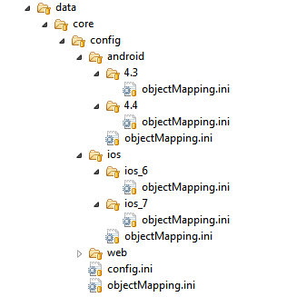
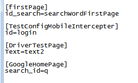

### 1 Create a new test application ###
A "test application" is the code specific to the Web or Mobile application under test. It consists of testNG files, Cucumber feature files, configurations and Java implementation files.

Use seleniumRobot-example project as a base to develop your own test application
[https://github.com/bhecquet/seleniumRobot-example](https://github.com/bhecquet/seleniumRobot-example)

- for the remainder, we use a unique name for that new application `appName`
- in pom.xml
	- remove all unnecessary plugins & configurations (see file comments)
	- change artifactId, groupId and version according to your organization
- change test package according to your organization. Last part of the package MUST BE `appName`
- change folder name under `data` to `appName`
- in `data/appName/testng/test_qwant.xml`, change value for `cucumberPackage` parameter according to the updated package name

#### Requirements are ####

- Test data are in `data/<app_name>/`
	- `features` contains feature files (mandatory if cucumber mode is used)
	- `testng` contains testng files to start tests (mandatory)
	- `config` contains centralized env test configuration (optional)
	- `squash-ta` contains ta files that should override the default ones (optional). See Squash-TA section for details 

- Test code must be in `src/test/java`
- package name is free but following structure should be used
	- `cucumber` subpackage contains cucumber implementation files. As cucumber annotations can be written directly in test page object, it should at least contain code for `@Then` (checks) and `@Given` (initial state).
If pure TestNG mode is used, this package should not exist.
	- `tests` subpackage contains code for pure TestNG tests (not cucumber). If cucumber mode is used, this package should not exist
	- `webpage` subpackage is mandatory as it contains PageObject implementation

*If something goes wrong when launching test, check:*
- project name, folder name under `data`, sub-package name, containing `webpages` *MUST BE THE SAME*
- There is no space in folder structure
- In cucumber mode, the `@Given` creating the first PageObject must not be in the PageObject class. It should be in `cucumber`subpackage instead

Once done, configure your project with aspectJ compiler. See procedure for eclipse or IntelliJ in file [chap2_Installation.md](chap2_Installation.md)

#### Post-installation ####

Run `mvn clean package` so that a <app>-version.txt file can be automatically generated by maven
This is used by core when logging information

### 2 PageObject ###
PageObject is a design pattern that helps writing maintainable selenium applications. Each screen of the website or mobile application is a class.
This class contains:

- fields which are the elements on the page
	- links
	- buttons
	- text fields
	- ...
- methods which are the available actions in the page
	- validate form
	- fill form
	- access an other page

Example of a shopping cart class:

	public class ShoppingCart extends HeaderAndFooter {
	
		private static LinkElement proceed = new LinkElement("Checkout", By.linkText("Proceed to Checkout"));
		private static LinkElement updateCart = new LinkElement("updateCart", By.name("updateCartQuantities"));
		private static Table cart = new Table("cart", By.tagName("table"));
	
		public ShoppingCart() throws Exception {
			super(proceed);
		}
		
		public ShoppingCart changeQuantity(String item, String newQuantity) {
			new TextFieldElement("quantity", By.name(item)).sendKeys(newQuantity);
			updateCart.click();
			return this;
		}
		
		public String getTotalAmount() {
			String amount = cart.getContent(cart.getRowCount() - 1, 0).replace("Sub Total: $", "");
			return amount;
		}
		
		public SignIn checkout() throws Exception {
			proceed.click();
			return new SignIn(); 
		}
		
		public PaymentDetails checkoutSignedIn() throws Exception {
			proceed.click();
			return new PaymentDetails(); 
		} 
	}
	
**WARN:** If you write your class combined with cucumber feature (methods annotated with @Given, @When, ...), only write methods returning `void`. Else, report will contain new page create step twice.

### 3 Write a test ###
A test is a suite of steps defined in several page objects. By convention, they are located in the `tests` folder
Assuming that the right objects are created, a test looks like:
    
    public class VmoeTests extends SeleniumTestPlan {
	
		@Test(
		        groups = { "vmoe" },
		        description = "check Angel Fish"
		    )
		public void consultProductDetails() throws Exception {
			ProductItem productItem = new JPetStoreHome(true)
				.goToFish()
				.accessAngelFish()
				.showItem("EST-1");
			Assert.assertEquals(productItem.getProductDetails().name, "Large Angelfish");
		}
	}

A typical method whould be

	public FishList goToFish() throws Exception {
    	fishMenu.click();
    	return new FishList();
    }
    
**WARN** DO NOT give the same test name in different test classes as it leads to wrong logging reporting

#### TestNG file ####
For tests extending SeleniumTestPlan, the testNg XML looks like (minimal requirements):

	<suite name="Integration tests" parallel="false" verbose="1" thread-count="1">

	    <test name="order">	    	
	        <classes>
	            <class name="com.infotel.seleniumRobot.jpetstore.tests.VmoeTests">
	            	<methods>
	            		<include name="orderFish" />
	            	</methods>
	            </class>
	        </classes>
	    </test>
	</suite>

### 4 Write a cucumber test ###
Cucumber styled tests rely on a `.feature` file where each test step is defined. Look at [https://cucumber.io/docs/reference](https://cucumber.io/docs/reference) for more information about writing a feature file.

Each line in the feature file must correspond to an implementation inside java code through annotation

	@When("Cliquer sur le lien 'FISH'")
    public void goToFish() throws Exception {
    	fishMenu.click();
    }

**WARN:**You should write only void methods to avoid getting twice the page creation in report
**WARN:**Java8 style (lambda expressions) is currently not supported by framework. Use only @Annotation style

#### Feature file example ####
	Feature: Catalogue
	
		Scenario: Consulter la fiche Angel Fish
			
			Given Ouvrir le jPetStore
			When Cliquer sur le lien 'FISH'
			And Cliquer sur le produit 'Angel Fish'
			And Cliquer sur le type 'EST-1'
			Then Le nom du produit est 'Large Angelfish'

#### TestNG file ####
XML testNg file looks like:

	<!DOCTYPE suite SYSTEM "http://beust.com/testng/testng-1.0.dtd" >
	<suite name="Integration tests" parallel="false" verbose="1" thread-count="1">
	
		<parameter name="cucumberPackage" value="com.infotel.seleniumRobot.jpetstore" />
	    
	    <test name="consult_catalog">
	    	<parameter name="cucumberTests" value="Consulter la fiche Angel Fish" />
		    <parameter name="cucumberTags" value="" />
	    	
	        <packages>
	            <package name="com.seleniumtests.core.runner.*"/>
	        </packages>
	    </test>
	   
	</suite>

`cucumberPackage` parameter is mandatory so that framework knows where implementation code resides. `cucumberTests` and `cucumberTags` help selecting the right scenario. See §4 for details

### 5 Working with frames ###
In case an HTML element has to be searched inside an iFrame there are 2 ways to handle this

#### Selenium way ####
Selenium offers the way to switch focus to an iframe using

	driver.switchTo().frame(<frameElement>)  // => switch to the iframe previously searched. Each search after this call will be done inside frame
	driver.switchTo().defautlContent()		 // => go back to the main page
	
The drawback of this approach is that if iframe reloads after switching, each element search will fail
Moreover, no retry is done when searching frame

#### SeleniumRobot way ####
SeleniumRobot adds a way to retry a search when an error occurs even using iframes

	// declare your frame as any other element inside page.
	FrameElement frame = new FrameElement("my frame", By.id("frameId"));
	
	// declare your element as being present inside this frame (the frame parameter)
	HtmlElement el = new HtmlElement("my element", By.id("el"), frame);
	
	// use the element
	el.click();
	
This way, each time an action is performed on the element, SeleniumRobot will:

- search the frame and switch to it
- act on element
- switch to default content

If an error occurs during one of these actions, SeleniumRobot will retry

### 6 Configure test scripts ###
There are several ways to make values in test script change according to test environment, executed test, ...

#### XML configuration ####
XML testing file handles many technical configurations: server address, used tools and related configuration.
 
Business configuration can be done through the �unknown� parameters. These are parameters which are not known from the framework. They are added to a list of business parameters.

#### Confg.ini configuration ####
XML configurations are done statically and must be duplicated through all the test suites (or using �testConfiguration� parameter). It�s not possible to have a centralized configuration which depends on test environment.

*Example:* the server URL depends on testing phase. They are not the same in production and in integration phase.

That�s why the �env.ini� file is made for. Each tested application can embed a env.ini file whose format is: 

 
�General� section is for common configuration (e.g: a database user name which does not depends on environment) and other sections are specific to named test environments. Here, we define a �Dev� environment. Then, when launching test, user MUST define the environment on which test will be run with the option `-Denv=Dev`

Keys defined in environment sections override the ones in �General� section.
This file must be located in "<<t>application root>/data/<<t>application name>/config" folder.

These configurations are also stored in the business configuration.

#### Using configurations (aka business configuration) in test scripts ####
Each webpage can use the configurations defined above using (getting variable �text� from configuration):

### 7 Test script configuration mapping ###
#### Mapping files utility ####

Mapping file give possibility to call an element in a web page with a more accessible and understandable word. This way your code gain clarity for a non technical user.
Every element can be redefined for any platform and version, you just have to create a hierarchical architecture of files :
example :

#### objectMapping.ini configuration ####

Each file can define new elements, and it inherits parents files.
The structure of an objectMapping.ini file looks like that :

between [ ] you define the web page where to use the following definitions. Next, there is the word definitions : caller_word:technical_word

#### Mapping data use ####

In the corresponding pageObject you can use mapping words to search elements using : locateBy(map:caller_word) or by.id(map:caller_word). It will search the element in the page which is defined by the technical word. 

### 8 Optional features ###
Here will be described features that may be used to improve test

#### Soft assertions ####
By default, inside a test, checks will be done using TestNG `Assert` class
On assert failure, test will continue but error will be reported
If this behaviour is not expected, then use the parameter `softAssertEnabled` and set it to false

### 9 Write good tests and Page Objects ###

According to `http://www.slideshare.net/saucelabs/how-to-grade-your-selenium-tests-by-dave-haeffner-sauce-labs-webinar?mkt_tok=eyJpIjoiTlRFeVpUTXdNbVpoTlRNMiIsInQiOiI2UzdLYnBraTczaHU0cUM0Z1FcL2pxOWZEVFhPdWxRa2h0QjJXZFwvK1B2NXRXRnhpWVk4MlFmcGE5eE5Ub3lkUG40UXNES1JENzhHMmExREg4aG9wRTFMZHBSTGdFaWIyeWEzcXpXb1BvTHRVPSJ9`
you should follow these rules:
- each test is independant
- common parts are centralized (eased with PageObject)
- No explicit waits and sleeps: handled by this framework. At most configure proper timeouts
- Assertions are in tests, not in Page Object
- A Page Object contains locators (see example) and actions (the methods). They are seperated to simplify readability
- the locator use order is: id, name, className, cssPath, xPath, linkText because the first are most of time unique and do not change each time the DOM changes

### 10 Use Selenium code style inside SeleniumRobot ###

As PageObject exposes the `driver` object, it's possible to write standard Selenium code
	
	driver.findElement(By.id("myId")).click();
	
SeleniumRobot intercept selenium calls to create HtmlElement objects (the same as in §2) and thus benefit all SelniumRobot behaviour
The constraint is that this code *MUST* be placed in a PageObject sub-class

This should be seen as a way to migrate legacy selenium code to the new format without rewriting every old test 

The handled methods are the most used in selenium writing:
- findElement(By)
- findElements(By)
- switchTo().frame(int)
- switchTo().frame(WebElement)
- switchTo().frame(String)
- switchTo().defaultContent()
- switchTo().parentFrame()
