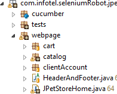
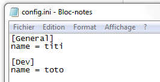
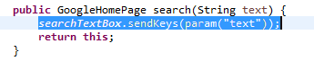
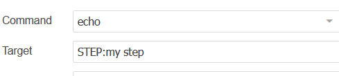
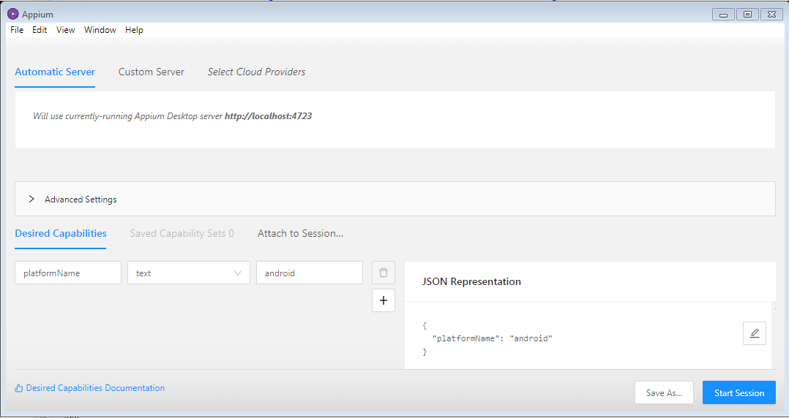

<!-- START doctoc generated TOC please keep comment here to allow auto update -->
<!-- DON'T EDIT THIS SECTION, INSTEAD RE-RUN doctoc TO UPDATE -->
**Table of Contents**

- [1 Create a new test application](#1-create-a-new-test-application)
  - [Requirements are](#requirements-are)
  - [Handle multiple version of the same test application](#handle-multiple-version-of-the-same-test-application)
  - [Post-installation](#post-installation)
- [2 PageObject](#2-pageobject)
  - [PageObject inheritance](#pageobject-inheritance)
  - [PageObject constructors](#pageobject-constructors)
    - [Check for presence of an element on opening](#check-for-presence-of-an-element-on-opening)
    - [Open URL and check for element present](#open-url-and-check-for-element-present)
    - [Open page with different loading strategy](#open-page-with-different-loading-strategy)
    - [Attach to an existing browser](#attach-to-an-existing-browser)
  - [Search elements](#search-elements)
    - [Standard search](#standard-search)
    - [Search inside an other element](#search-inside-an-other-element)
    - [Search inside frame](#search-inside-frame)
    - [Additional search capabilities](#additional-search-capabilities)
      - [Shadow DOM](#shadow-dom)
  - [Document your tests](#document-your-tests)
    - [Step naming](#step-naming)
    - [Most probable error cause](#most-probable-error-cause)
  - [Add user defined test steps](#add-user-defined-test-steps)
  - [Add snapshots](#add-snapshots)
  - [Work with multiple browsers](#work-with-multiple-browsers)
    - [Use several browsers inside one test scenario](#use-several-browsers-inside-one-test-scenario)
    - [Attach an existing browser inside your scenario](#attach-an-existing-browser-inside-your-scenario)
- [3 Write a test](#3-write-a-test)
  - [Accessing test data and storing temp data](#accessing-test-data-and-storing-temp-data)
  - [Use variable server to hold variables during some days](#use-variable-server-to-hold-variables-during-some-days)
  - [Using TestNG annotations](#using-testng-annotations)
    - [Test context](#test-context)
  - [Use driver inside a @BeforeMethod method](#use-driver-inside-a-beforemethod-method)
  - [masking password](#masking-password)
  - [TestNG file](#testng-file)
  - [Access some path on disk](#access-some-path-on-disk)
  - [Access robot configuration](#access-robot-configuration)
  - [Increase number of retries ( >= 4.8.8)](#increase-number-of-retries---488)
  - [Use generic steps](#use-generic-steps)
    - [Example](#example)
    - [Use Generic steps with user defined steps](#use-generic-steps-with-user-defined-steps)
  - [Use WebDriverWait](#use-webdriverwait)
  - [Use Dataprovider](#use-dataprovider)
  - [Use placeholders in test description and test name](#use-placeholders-in-test-description-and-test-name)
  - [Execute or kill a process](#execute-or-kill-a-process)
    - [Kill an existing process](#kill-an-existing-process)
    - [Start a process / execute a command](#start-a-process--execute-a-command)
- [4 Write a cucumber test](#4-write-a-cucumber-test)
  - [Feature file example](#feature-file-example)
  - [TestNG file](#testng-file-1)
  - [Use Generic Cucumber Steps](#use-generic-cucumber-steps)
- [5 Working with frames](#5-working-with-frames)
  - [Selenium way](#selenium-way)
  - [SeleniumRobot way](#seleniumrobot-way)
- [6 Configure test scripts](#6-configure-test-scripts)
  - [XML configuration](#xml-configuration)
  - [env.ini configuration](#envini-configuration)
  - [seleniumRobot server](#seleniumrobot-server)
  - [Using configurations (aka business configuration) in test scripts](#using-configurations-aka-business-configuration-in-test-scripts)
  - [Order of use](#order-of-use)
  - [Using placeholders in variable value (>= 4.20.0)](#using-placeholders-in-variable-value--4200)
- [7 Optional features](#7-optional-features)
  - [Soft assertions](#soft-assertions)
  - [Log some information inside a test step](#log-some-information-inside-a-test-step)
  - [Log some information at test level](#log-some-information-at-test-level)
- [8 Write good tests and Page Objects](#8-write-good-tests-and-page-objects)
- [9 Use Selenium code style inside SeleniumRobot](#9-use-selenium-code-style-inside-seleniumrobot)
- [10 Use external dependencies](#10-use-external-dependencies)
- [11 Customize Selenium IDE tests](#11-customize-selenium-ide-tests)
  - [Add steps](#add-steps)
  - [Call Java code](#call-java-code)
  - [Mask passwords](#mask-passwords)
- [12 Write mobile tests](#12-write-mobile-tests)
- [13 Implement custom SelectList](#13-implement-custom-selectlist)
- [14 Using custom UI libraries](#14-using-custom-ui-libraries)

<!-- END doctoc generated TOC please keep comment here to allow auto update -->


### 1 Create a new test application ###
A "test application" is the code specific to the Web or Mobile application under test. It consists of testNG files, Cucumber feature files, configurations and Java implementation files.

Use seleniumRobot-example project as a base to develop your own test application
[https://github.com/bhecquet/seleniumRobot-example](https://github.com/bhecquet/seleniumRobot-example)

for the remainder, we use a unique name for that new application `appName`<br/>
**BE CAREFUL**: application name MUST NOT contain any `_` (underscore character)
**AND**: `appName` MUST BE THE SAME AS artifactId in your pom.xml for a correct build
- in pom.xml
	- remove all unnecessary plugins & configurations (see file comments)
	- change artifactId, groupId and version according to your organization. artifactId is `appName`
- change test package according to your organization. Last part of the package MUST BE `appName`
- change folder name under `data` to `appName`
- in `data/appName/testng/test_qwant.xml`, change value for `cucumberPackage` parameter according to the updated package name
- write a minimal test (or re-use the example)
- compile code with `mvn clean package`
- **WARNING Oracle JDBC**: when compiling test application code, dependency ojdbc6.jar is searched. If your test application does not use Oracle DB connection, exclude oracle artifact from core using 

```xml
	<dependency>
		<groupId>com.infotel.seleniumRobot</groupId>
		<artifactId>core</artifactId>
		<version>[3.9.1,)</version>
		<exclusions>
			<exclusion>
				<groupId>com.oracle</groupId>
				<artifactId>ojdbc6</artifactId>
			</exclusion>
		</exclusions>
	</dependency>
```
	
- else, you should add Jenkins repository which exposes it: <br/>
	> go to [https://repo.jenkins-ci.org/webapp/#/home](https://repo.jenkins-ci.org/webapp/#/home)<br/>
	> click on 'Set me up' and generate maven settings<br/>
	> important part is the mirror one
	
```xml
	<mirrors>
    <mirror>
      <mirrorOf>*</mirrorOf>
      <name>public</name>
      <url>https://repo.jenkins-ci.org/public</url>
      <id>public</id>
    </mirror>
  </mirrors>
```
	
- **WARNING ASPECTJ**: from seleniumRobot 3.14.0 version, aspectJ version has be changed (from 1.8.9 to 1.9.1) which introduces incompatibilities when building but not running tests. To use this seleniumRobot version, do the following

inside aspectj-maven-plugin definition (in pom.xml)
add:

```xml
	<dependencies>
		<dependency>
			<groupId>org.aspectj</groupId>
			<artifactId>aspectjtools</artifactId>
			<version>1.9.1</version>
		</dependency>
	</dependencies>
```


Also update aspectj-maven-plugin version to 1.11

The resulting plugin definition should look like:

```xml
	<plugin>
		<groupId>org.codehaus.mojo</groupId>
		<artifactId>aspectj-maven-plugin</artifactId>
		<version>1.11</version>
		<dependencies>
			<dependency>
				<groupId>org.aspectj</groupId>
				<artifactId>aspectjtools</artifactId>
				<version>1.9.1</version>
			</dependency>
		</dependencies>
		<configuration>
			<showWeaveInfo>true</showWeaveInfo>
			<aspectLibraries>
				<aspectLibrary>
					<groupId>com.infotel.seleniumRobot</groupId>
					<artifactId>core</artifactId>
				</aspectLibrary>
			</aspectLibraries>
			<complianceLevel>1.8</complianceLevel>
			<source>1.8</source>
			<target>1.8</target>
		</configuration>
		<executions>
			<execution>
				<goals>
					<goal>test-compile</goal>
				</goals>
			</execution>
		</executions>
	</plugin>
```
	
Moreover, you MUST set the minimal version of core to 3.14.0 in application dependencies:

```xml
	<dependencies>
		<dependency>
			<groupId>com.infotel.seleniumRobot</groupId>
			<artifactId>core</artifactId>
			<version>[3.14.0,)</version>
			...
		</dependency>
	</dependencies>
```

- If your repo do not include neotys artifacts (mandatory for compilation), add the following

```xml
	<repository>
		<id>neotys-public-releases</id>
		<url>http://maven.neotys.com/content/repositories/releases/</url>
		<releases>
			<enabled>true</enabled>
		</releases>
		<snapshots>
			<enabled>false</enabled>
		</snapshots>
	</repository>
```
	
to repository list in settings.xml, and 

```xml
	<pluginRepository>
		<id>neotys-public-releases</id>
		<url>http://maven.neotys.com/content/repositories/releases/</url>
		<releases>
			<enabled>true</enabled>
		</releases>
		<snapshots>
			<enabled>false</enabled>
		</snapshots>
	</pluginRepository>
```
	
to pluginRepository list in settings.xml


- execute it

#### Requirements are ####

- Test data are in `data/<appName>/`<br/>
	- `features` contains feature files (mandatory if cucumber mode is used)<br/>
	- `testng` contains testng files to start tests (mandatory)<br/>
	- `config` contains centralized env test configuration (optional)<br/>

- Test code must be in `src/test/java`
- **WARN** When using IntelliJ, you must also create a `src/main/java` with subpackage inside and a main class. This does nothing but IntelliJ cannot weave aspects without that: you get `Error:Module '<some_module>' tests: org.aspectj.bridge.AbortException: bad aspect library: 'D:\Dev\seleniumRobot-maaffr\target\classes'`
- package name is free but following structure MUST be used<br/>
	- `cucumber` subpackage contains cucumber implementation files. As cucumber annotations can be written directly in test page object, it should at least contain code for `@Then` (checks) and `@Given` (initial state).<br/>
If pure TestNG mode is used, this package MUST exist.<br/>
	- `tests` subpackage contains code for pure TestNG tests (not cucumber). If cucumber mode is used, this package should not exist<br/>
	- `webpage` subpackage is mandatory as it contains PageObject implementation<br/>



*If something goes wrong when launching test, check:*
- project name, folder name under `data`, sub-package name, containing `webpages` **SHOULD BE THE SAME**
- There is no space in folder structure
- In cucumber mode, the `@Given` creating the first PageObject must not be in the PageObject class. It should be in `cucumber`subpackage instead

Once done, configure your project with aspectJ compiler. See procedure for eclipse or IntelliJ in file [chap2_Installation.md](chap2_Installation.md)

#### Handle multiple version of the same test application ####
A SUT can be installed in several environement with different version: v3.0 in integration, v2.0 in acceptance tests, v1.0 in production
If you use the same seleniumrobot execution environment, you must be able to deploy several versions of the test application at the same time on this environment.
Therefore, do the following in pom.xml:
- Change `<finalName>${project.artifactId}</finalName>` by `<finalName>${project.artifactId}-${application.version.short}</finalName>`
- Change any execution of `maven-resources-plugin` containing `data`: <br/>
`<outputDirectory>${project.build.directory}/data/${project.artifactId}/config</outputDirectory>` by `<outputDirectory>${project.build.directory}/data/${project.artifactId}_${application.version.short}/config</outputDirectory>` <br/> 
`<outputDirectory>${project.build.directory}/data/${project.artifactId}/testng</outputDirectory>` by `<outputDirectory>${project.build.directory}/data/${project.artifactId}_${application.version.short}/testng</outputDirectory>` <br/> 
`<outputDirectory>${project.build.directory}/data/${project.artifactId}/features</outputDirectory>` by `<outputDirectory>${project.build.directory}/data/${project.artifactId}_${application.version.short}/features</outputDirectory>` <br/> 
- Add the plugin execution. It will be in charge of creating the `application.version.short` variable that we use above:

```xml
	<plugin>
		<groupId>org.codehaus.mojo</groupId>
		<artifactId>build-helper-maven-plugin</artifactId>
		<version>3.0.0</version>
		<executions>
			<execution>
				<id>regex-property</id>
				<goals>
					<goal>regex-property</goal>
				</goals>
				<configuration>
					<name>application.version.short</name>
					<value>${project.version}</value>
					<regex>^([0-9]+)\.([0-9]+)\.([0-9]+)(-SNAPSHOT)?$</regex>
					<replacement>$1.$2</replacement>
					<failIfNoMatch>true</failIfNoMatch>
				</configuration>
			</execution>
		</executions>
	</plugin>
```

#### Post-installation ####

Run `mvn clean package` so that a <app>-version.txt file can be automatically generated by maven
This is used by core when logging information

### 2 PageObject ###
PageObject is a design pattern that helps writing maintainable selenium applications. Each screen of the website or mobile application is a class.
This class contains:

- fields which are the elements on the page
	- links
	- buttons
	- text fields
	- ...
- methods which are the available actions in the page
	- validate form
	- fill form
	- access an other page

Example of a shopping cart class. All must inherit of PageObject class:

```java
	public class ShoppingCart extends PageObject {
	
		private static LinkElement proceed = new LinkElement("Checkout", By.linkText("Proceed to Checkout"));
		private static LinkElement updateCart = new LinkElement("updateCart", By.name("updateCartQuantities"));
		private static Table cart = new Table("cart", By.tagName("table"));
	
		public ShoppingCart() throws Exception {
			super(proceed);
		}
		
		public ShoppingCart changeQuantity(String item, String newQuantity) {
			new TextFieldElement("quantity", By.name(item)).sendKeys(newQuantity);
			updateCart.click();
			return this;
		}
		
		public String getTotalAmount() {
			String amount = cart.getContent(cart.getRowCount() - 1, 0).replace("Sub Total: $", "");
			return amount;
		}
		
		@Step(name="checkout cart")
		public SignIn checkout() throws Exception {
			proceed.click();
			return new SignIn(); 
		}
		
		public PaymentDetails checkoutSignedIn() throws Exception {
			proceed.click();
			return new PaymentDetails(); 
		} 
	}
```
	
**WARN:** If you write your class combined with cucumber feature (methods annotated with @Given, @When, ...), only write methods returning `void`. Else, report will contain new page create step twice.

#### PageObject inheritance ####

Most of the time, Page classes will inherit from PageObject classes. But, if for some reason, you need to have the same features in several pages (e.g: headers and footer are often common among all the web site), then, you can create a class that handled these common features (which extends PageObject), and then inherit it.

#### PageObject constructors ####

Each Page class will extend PageObject class, and so, calling it's constructors.

##### Check for presence of an element on opening #####
Most of the time, you will call this constructor who is provided an element to check for presence. If 'myElement' is not present when page opens, then test fails

```java
	private static HtmlElement myElement = new HtmlElement("element", By.name("anElement"));

	public MyPageObject() throws Exception {
			super(myElement);
		}
```

##### Open URL and check for element present #####

PageObject will connect to provided url (and start browser if necessary), then check 'myElement' is present

```java
	private static HtmlElement myElement = new HtmlElement("element", By.name("anElement"));

	public MyPageObject(String url) throws Exception {
			super(myElement, url);
		}
```

##### Open page with different loading strategy #####

By default, PageObject waits for page to load completely before doing anything else (document.ready). But sometimes, due to external javascript loading, page may be very long to load (or never load completely) before selenium 'pageLoadTimeout' raises. In this case, you can write (see: [https://www.selenium.dev/documentation/en/webdriver/page_loading_strategy/](https://www.selenium.dev/documentation/en/webdriver/page_loading_strategy/) for details)
Default driver strategy (that applies to all pages) can be set using `pageLoadStrategy` seleniumRobot option on starting.

```java
	private static HtmlElement myElement = new HtmlElement("element", By.name("anElement"));

	public MyPageObject(String url) throws Exception {
			super(myElement, url, PageLoadStrategy.NONE);
		}
```

##### Attach to an existing browser #####

See [Attach an existing browser inside your scenario](#attach-an-existing-browser-inside-your-scenario)

#### Search elements ####

##### Standard search #####

SeleniumRobot supports standard search through `By` class

```java
	LinkElement proceed = new LinkElement("Checkout", By.linkText("Proceed to Checkout"));
```
	
If you search an element by XPath (avoid this if possible), and your xpath should be relative to a parent element (`new HtmlElement("", By.id("parentDiv")).findElement(By.xpath("//option[@value=\"opt1\"]"));`), add a `.` in front of your xpath expression so that you search relatively to the parent element. Else, SeleniumRobot do this for you.

The available elements are:
- ButtonElement
- CheckBoxElement
- DatePickerElement: to handle angular materials date picker. For now, it only handles the sendKeys / clear methods which may behave differently than in TextFieldElement.
- FileUploadElement: to handle `<input type="file">` elements
- FrameElement: to define a frame to be used inside other elements (see: "5 Working with frames" chapter for details)
- HtmlElement: the parent of all elements defined here
- LabelElement
- LinkElement
- ImageElement: to handle `` elements
- RadioButtonElement
- SelectList: handle `<select>` elements, `<ul>` select styled lists,  `<mat-select>` (from angular-materials) select list and salesforce lightning combobox `<lightning-base-combobox>`. Other types of selects may be implemented and loaded through SPI, see §16
- Table
- TextFieldElement

Most of them are here for readability so that when you read test code, you know what type of element this object corresponds to. Use HtmlElement only when the type of element is not very clear (e.g: a div / span or DOM area)

##### Search inside an other element #####

Using Selenium syntax, you would use: `driver.findElement(By.id("myId")).findElement(By.tagName("myTag"))`<br/>
This obviously still works in seleniumRobot, but using seleniumRobot syntax, you have to ways:
 
```java 
	new HtmlElement("", By.id("myId")).findElement(By.tagName("myTag"))
```
	
- or
	
```java
	HtmlElement parent = new HtmlElement("", By.id("myId"));
	HtmlElement myElement = new HtmlElement("", By.tagName("myTag"), parent)
```

##### Search inside frame #####
see: "5 Working with frames" chapter for details

##### Additional search capabilities #####
	
Additional search using the `ByC` class are
- search element by attribute: `new TextFieldElement("", ByC.attribute("attr", "attribute")).sendKeys("element found by attribute");`. See: [https://developer.mozilla.org/en-US/docs/Web/CSS/Attribute_selectors](https://developer.mozilla.org/en-US/docs/Web/CSS/Attribute_selectors) for special syntax like searching with attribute value starting by some pattern `ByC.attribute("attr^", "attributeStartPattern")`. Only '*' (contains), '^' (startswith) and '$' (endswith) syntax are supported.
- search element after a label: `new TextFieldElement("", ByC.labelForward("By id forward", "input")).sendKeys("element found by label");`. See: [https://developer.mozilla.org/en-US/docs/Web/CSS/Attribute_selectors](https://developer.mozilla.org/en-US/docs/Web/CSS/Attribute_selectors) for special syntax like searching with label starting by some pattern `ByC.labelForward("By id forw^", "input"))`. Only '*' (contains), '^' (startswith) and '$' (endswith) syntax are supported
- search element before a label: `new TextFieldElement("", ByC.labelBackward("By id backward", "input")).sendKeys("element found by label backward");`. See: [https://developer.mozilla.org/en-US/docs/Web/CSS/Attribute_selectors](https://developer.mozilla.org/en-US/docs/Web/CSS/Attribute_selectors) for special syntax like searching with label starting by some pattern `ByC.labelBackward("By id back^", "input")`. Only '*' (contains), '^' (startswith) and '$' (endswith) syntax are supported
- search element by text: `new TextFieldElement("", ByC.text("my text")).sendKeys("element found by text");`. See: [https://developer.mozilla.org/en-US/docs/Web/CSS/Attribute_selectors](https://developer.mozilla.org/en-US/docs/Web/CSS/Attribute_selectors) for special syntax like searching with attribute value starting by some pattern `ByC.text("mytex^")`. Only '*' (contains), '^' (startswith) and '$' (endswith) syntax are supported
- search by first visible element: `new HtmlElement("", By.className("otherClass"), HtmlElement.FIRST_VISIBLE).getText()`
- search in reverse order (get the last element): `new TextFieldElement("", By.className("someClass"), -1);` get the last element on the list
- search with several criteria: `new TextFieldElement("", ByC.and(By.tagName("input"), By.name("textField")))`
- search element with one criteria or an other. Specifically usefull to handle multiple mobile OS: `new HtmlElement("or", ByC.or(ByC.ios(By.name("textField")), ByC.android(By.id("text2")))`
- search element inside shadow-root: see below

`ByC` selectors ('xId', 'xName', 'xTagName', 'xLinkText' and 'xPartialLinkText') replicate the behavior of standard Selenium selectors but using xpath method. This is needed for salesforce UI automation where lightning UI prevents selenium to discover sub-elements of a custom element.

###### Shadow DOM ######

To search inside a shadow-root element: `HtmlElement parent = new HtmlElement("", ByC.shadow(By.id("shadow5"), By.id("shadow6")));`. 
This way, you have a parent which allow you to search inside as any other parent. ByC.shadow() can take any number of locator, which replicate the shadow-root tree.

If you need to take the n-th shadow-root element, there are 2 cases
 - the n-th element is the child shadow-root (last in the list). Then you can write `HtmlElement parent = new HtmlElement("", ByC.shadow(By.id("shadow5"), By.id("shadow6")), 3);`. This will take the third "shadow6" inside "shadow5"
 - the n-th element is NOT the child shadow-root. Then you MUST write search in two lines: 
 `HtmlElement parent1 = new HtmlElement("", ByC.shadow(By.id("shadow5")), 3);`
 `HtmlElement parent2 = new HtmlElement("", ByC.shadow(By.id("shadow6")), parent1);`

#### Document your tests ####

##### Step naming #####

By default, when reporting is built, step names come from method names. For more readability, you can annotate your steps with `@Step(name="my name")` annotation
This way, step name will be the name defined in annotation
	
	@Step(name="checkout cart")

Step name can also use placeholders for method parameters. They will be replaced by real values in report

	@Step(name="order ${number} ${product}")
	
where method takes 'number' and 'product' arguments 

##### Most probable error cause #####

Through `@Step` annotation, it's possible to define the most probable cause of error when test fails at this step


		@Step(errorCause=RootCause.DEPENDENCIES, errorCauseDetails="Application X is unavailable")
		public SignIn checkout() throws Exception {
			proceed.click();
			return new SignIn(); 
		}

If the test fails at this step, the possible cause of failure will be displayed in report to help diagnose error.

#### Add user defined test steps ####

By default, framework creates automatically test steps based on method calls. Every PageObject method called from a Test class is a step (for e.g)
If this behavior is not what you want, you can disable it by setting `manualTestSteps` to `true` as test parameters. 
Then, in Test class or PageObject sub-class, add `addStep("my step name")` where you want a step to be created. Every subsequent actions will be recorded to this step

For each step, a snapshot is done and step duration is computed

If, inside a step, you need to mask a password, (see: "masking password" section), give the value (generally, the variable name) to the `addStep` method

```java
	addStep("my step name", myValueForPassword)
```

#### Add snapshots ####

Each new page takes automatically a snapshot. If you want more snapshots (be careful, each snapshot takes 2 - 5 seconds), in your PageObject, call

```java
capturePageSnapshot();
```
or

```java
captureElementSnapshot(<myWebElement>);
```

If you want to compare these pictures with previous execution through seleniumRobot server (assuming option `seleniumRobotServerCompareSnapshots` is set to true), call instead. Difference is that you give a snapshot name to ease comparison

```java
capturePageSnapshot(<pic_name>, SnapshotCheckType.TRUE);
```
or

```java
captureElementSnapshot(<pic_name>, <myWebElement>, SnapshotCheckType.TRUE);
```

#### Work with multiple browsers ####

##### Use several browsers inside one test scenario #####

Some rare tests require to start several browsers (one for each application which should be tested at the same time). For example, you have to create a client account on front-office with Chrome, then delete this client onto the back-office with Internet Explorer.
To do so, you can request a PageObject to create a new driver. By default, it creates it only if none already exists.

- Test is driven by Chrome, it's configured so in TestNG XML file. With the code below, we will create a chrome browser on URL "http://front-office.mycompany.com". Chrome will be referenced under the name `main` which is the default name for the first created driver

```java
    public FrontOfficePage() throws Exception {
        super(myFOElementToCheck, "http://front-office.mycompany.com");
    }
```
    
- After having created the client, we will connect to the back-office using Internet Explorer. At this point, the default driver becomes the newly created one (Internet Explorer). It's referenced under the name `bo-browser`
    
```java
    public BackOfficePage() throws Exception {
        super(myBOElementToCheck, "http://back-office.mycompany.com", BrowserType.INTERNET_EXPLORER, "bo-browser", null);
    }
```

- The test will look like this
    
```java
    // create client on front-office
    FrontOfficePage foPage = new FrontOfficePage()._createClient()
        ._doSomethingElse();
                                
    // delete client on back-office
    new BackOfficePage()._accessClient()
        ._deleteClient();
                                
    // switch back to Chrome for any other operations. 'main' is the name of Chrome when it has been created
    switchToDriver("main");
    
    foPage._recreateClient();
```

    

##### Attach an existing browser inside your scenario #####

Sometimes, a scenario needs a browser launched by an other application (web or not)
By default, selenium does not permit this easily but with seleniumRobot, you can do this (only for Internet Explorer and Chrome for now)

This attaching can be done only from a page creation

- For Internet Explorer, note the last parameter when creating the new page (any integer is valid):

```java
    public BackOfficePage() throws Exception {
        super(myBOElementToCheck, "http://back-office.mycompany.com", BrowserType.INTERNET_EXPLORER, "bo-browser", 0);
    }
```
    
- For Chrome, start your browser with `--remote-debugging-port=xxxx`. In the example below, xxxx = 11111. Then, in your page creation (note the 11111 as last parameter which tells robot to connect to chrome on debugger port 11111)

```java
    public BackOfficePage() throws Exception {
        super(myBOElementToCheck, "http://back-office.mycompany.com", BrowserType.CHROME, "bo-browser", 11111);
    }
```
    
**WARN**: for Internet explorer, a modified version of IEDriverServer is required. Provided in seleniumRobot-driver artifact

**LIMIT**: This approach is limited to one Internet Explorer started programmatically. It will not work with IE started manually as IE must be started the same way IEDriverServer starts it.


### 3 Write a test ###
A test is a suite of steps defined in several page objects. By convention, they are located in the `tests` folder
Assuming that the right objects are created, a test looks like:
  
 ```java  
    public class VmoeTests extends SeleniumTestPlan {
	
		@Test(
		        groups = { "vmoe" },
		        description = "check Angel Fish"
		    )
		public void consultProductDetails() throws Exception {
			ProductItem productItem = new JPetStoreHome(true)
				._goToFish()
				._accessAngelFish()
				._showItem("EST-1");
			Assert.assertEquals(productItem.getProductDetails().name, "Large Angelfish");
		}
	}
```

A typical PageObject method whould be

```java
	public FishList _goToFish() throws Exception {
    	fishMenu.click();
    	return new FishList();
    }
```

**WARN** DO NOT give the same test name in different test classes as it leads to wrong logging reporting

#### Accessing test data and storing temp data ####
See part 6 ("env.ini configuration" and "seleniumRobot server") to see how to get test data in scenario

You may consider putting all test data access in the Test script, not in page object. This helps maintenance when we want to know which variables are used.

```java
	@Test(groups={"recevabilite"})
	public void testSearch() throws Exception {
		new MireRH(true)
				._login(param("login"), param("password"))
				._arrivee();
	}
```
	
Test data are get using 
- `param(<key>)` is used to get a variable by its full name
- `param(Pattern.compile(<key_pattern>))` is used to get a variable by pattern on the name. For example `param(Pattern.compile("var.*Name"))` for searching all variables whose name matches "var<something>Name". Only one value will be get if multiple variables match.
- `param(Pattern.compile(<key_pattern>), Pattern.compile(<value_pattern>))` is used to get a variable by pattern on the name / value. For example `param(Pattern.compile("var.*Name"), Pattern.compile("var.*Value"))` for searching all variables whose name matches "var<something>Name" and value matches "var<someThing>Value". Only one value will be get if multiple variables match.
- `param(null, Pattern.compile(<value_pattern>))`is used to get a variable by pattern on the value.

Test data are updated via `createOrUpdateParam`. The later is only available when seleniumRobot server is used.
- `createOrUpdateParam(<key>, <value>)` is used to store a variable with reference to environment, application
- `createOrUpdateParam(<key>, <value>, <attach_to_version>)` is used to store a variable with reference to environment, application. Reference to application version is optional
- `createOrUpdateParam(<key>, <value>, <attach_to_version>, <time_to_live>, <reservable>)` is used to store a variable with reference to environment, application. Reference to application version is optional. In this case, we can specify that server will destroy variable after X days (the time to live) and that this variable can be reserved. 

#### Use variable server to hold variables during some days ####

The use case is: 
- test script creates some object (say, a client)
- test script stores the client name or id to selenium server for later reuse
- several other test scripts needs a client reference to work on, so they need to reserve it so that they do not work on the same client at the same time. Clients created recently cannot be used because some batch needs to be executed and it's executed during the next night. So, we need client from the day before on which batch has been executed
- to avoid having too many clients stored in selenium server database, these temp variables are destroyed after timeToLive value.

When storing your variable, use: `createOrUpdateParam(<key>, <value>, <attach_to_version>, <time_to_live>, <reservable>)` with reservable=true and time_to_live > 0
When executing test, use parameter `seleniumRobotServerVariablesOlderThan=1` so that we only get variables created the day before. Keep in mind that this parameter only applies to variables created with a timeToLive value > 0. Other variables are returned without restriction.

#### Using TestNG annotations ####

As we use TestNG for test running, it's possible to use any TestNG annotation in your test class. See: [http://testng.org/doc/documentation-main.html] (http://testng.org/doc/documentation-main.html), section "2. annotation"<br/>
For more information on execution order of TestNG annotations, see [https://stackoverflow.com/questions/30587454/difference-between-beforeclass-and-beforetest-in-testng] (https://stackoverflow.com/questions/30587454/difference-between-beforeclass-and-beforetest-in-testng)

##### Test context #####

Test context is a set of technical information used to run the test (connect parameters, browser, ...). These information come from TestNG XML file and from user parameters (`DmyParam=myValue`)
It's managed by `SeleniumTestsContextManager` class which handles `SeleniumTestsContext` instances.

Only at start of test method, the context is completed with test data coming from `env.ini` file or from variable server.

**WARN** TestNG allows you to use `@BeforeTest`, `@BeforeMethod`, `@BeforeClass` annotated method to init the test. In these methods (as for `@AfterTest`, `@AfterClass`, `@AfterMethod`), you can access the test context using for example  `SeleniumTestsContextManager.getThreadContext().setBrowser("chrome");`. So 3 state context are stored: 
- test context (the one fetched from TestNG XML file)
- class context
- method context

"Method context" inherits from "class context" if existing, which itself inherits from "test context"

- `@AfterTest` context is the same as the one after `@BeforeTest` call. Or it defaults to context from XML file
- `@AfterClass` context is the same as the one after `@BeforeClass` call, or if not present, the test context
- `@AfterMethod` context is the same as the one after `@Test` call

`@BeforeMethod` annotated methods MUST declare a `java.lang.reflect.Method` argument as first parameter to be usable (this is automatically injected by TestNG). Else, a ScenarioException is raised.

#### Use driver inside a @BeforeMethod method ####

From version 4.7.0, it's possible to use driver inside @BeforeMethod method.
Be careful when using selenium grid, if driver is closed in this method, the driver started inside the @Test method may not be started on the same node. You should instead reuse the existing driver
 
#### masking password ####

Most of tests needs to write password to application to authenticate, open some view, ...
By default, reports produced by SeleniumRobot display all actions, steps containing method calls with arguments. Then all password may be visible to anyone.
To avoid this potential security risk, name your method arguments containing a password with one of this 3 ways: `password`, `pwd`, `passwd`.
Any argument name containing one of these words will be masked ONLY IF LONGER THAN 5 CHARACTERS.
e.g: `myPassWordLong` will also be masked as containing `password`

	Step _setPassword with args: (myPass, )
	sendKeys on TextFieldElement Text, by={By.id: text2} with args: (true, true, [myPass,])
	
becomes

	Step _setPassword with args: (******, )
	sendKeys on TextFieldElement Text, by={By.id: text2} with args: (true, true, [******,])
	
because method `_setPassword` signature is `public DriverTestPage _setPassword(String passWordShort) {`


**WARN: ** With manual steps, you have to explicitly give the passwords to mask when creating test steps 

```java
	addStep("my step name", myValueForPassword)
	addStep("my step name", myValueForPassword1, myValueForPassword2)
```

**WARN: ** When the password is given to test method using @DataProvider, the above won't work due to java limitation during compilation. To hide pasword, use the @Mask annotation

```
@Test
public void methodWithPassword(Integer col1, @Mask Integer sensibleData) throws IOException {
        logger.info(String.format("%d,%d", col1, sensibleData == null ? -1: sensibleData));
    }
```

The `@Mask` annotation will also work on test steps, in case you do not want to name your variable 'password' / 'pwd' / ...

For Selenium IDE tests, see §11

#### TestNG file ####
For tests extending SeleniumTestPlan, the testNg XML looks like (minimal requirements):

```xml
	<suite name="Integration tests" parallel="false" verbose="1" thread-count="1">
	    <test name="order">	    	
	        <classes>
	            <class name="com.infotel.seleniumRobot.jpetstore.tests.VmoeTests">
	            	<methods>
	            		<include name="orderFish" />
	            	</methods>
	            </class>
	        </classes>
	    </test>
	</suite>
```
	
For more information on execution order of TestNG annotations, see [https://stackoverflow.com/questions/30587454/difference-between-beforeclass-and-beforetest-in-testng] (https://stackoverflow.com/questions/30587454/difference-between-beforeclass-and-beforetest-in-testng)

#### Access some path on disk ####

When you want to access a file on seleniumRobot path (for example, a file you put in data), you cas access relative path using `SeleniumTestsContextManager` static methods

- `SeleniumTestsContextManager.getApplicationDataPath()` => <seleniumRobot path>/data/<application>
- `SeleniumTestsContextManager.getConfigPath()` => <seleniumRobot path>/data/<application>/config
- `SeleniumTestsContextManager.getFeaturePath()` => <seleniumRobot path>/data/<application>/features
- `SeleniumTestsContextManager.getDataPath()` => <seleniumRobot path>/data/
- `SeleniumTestsContextManager.getRootPath()` => <seleniumRobot path>

#### Access robot configuration ####

Access to robot configuration can be done through `SeleniumTestsContextManager.getThreadContext()`

As of 3.10.4, robot configuration can be accessed in test and web page with `robotConfig()`
This is also possible to access the paths described above using:
`robotConfig().getApplicationDataPath()` for example

#### Increase number of retries ( >= 4.8.8) ####

By default, a test is retried 2 times (3 executions). You can customize this number with `testRetryCount` parameter
In case you want to dynamically (inside the running test), increase the maxretry count, call `increadMaxRetry()` from the test method

This is useful, if, for example, you have detected that your dataset is not available anymore and you do not want to consume a retry for that

Test will be retried at most `2 * testRetryCount`

#### Use generic steps ####

A test scenario is a suite of actions on test Page. Previous documentation showed how to write a PageObject (§2) subclass that contains elements to locate and actions on them.
But most of the time, these actions are very simple: click on element, writing some text, ...
To avoid writing Page methods without added value, PageObject class embeds generic steps:

- actions: click, switch to new window, ...
- waits: wait for element to be displayed, value, ...
- checks: check value of element, ...

##### Example #####

A typical test would look like this

```java
	new ShoppingCart()
			.sendKeysToField("amount", "foo")
			.assertForValue("textElement", "foo")
			.click("validate");
```

The class would be

```java
	public class ShoppingCart extends PageObject {
	
		private static TextFieldElement amount = new TextFieldElement("Amount", By.id("cart_amount"));
		private static CheckBoxElement validate = new CheckBoxElement("Validate cart", By.name("valid"));
		
		
		public ShoppingCart() throws IOException {
			super();
		}
	}
```

Each generic step takes the element name as a first argument. Element name is the name of the variable in class (e.g: 'amount', 'validate' in above example)

##### Use Generic steps with user defined steps #####

For more complex actions, generic steps may not be suitable and you will need to write custom steps

```java
	public class ShoppingCart extends PageObject {
	
		private static TextFieldElement amount = new TextFieldElement("Amount", By.id("cart_amount"));
		private static CheckBoxElement validate = new CheckBoxElement("Validate cart", By.name("valid"));
		private static LinkElement proceed = new LinkElement("Checkout", By.linkText("Proceed to Checkout"));
		
		public ShoppingCart() throws IOException {
			super();
		}
		
		public PaymentDetails _checkoutSignedIn() throws Exception {
			proceed.click();
			return new PaymentDetails(); 
		} 
	}
```

Test would then be:

```java
	new ShoppingCart()
			.sendKeysToField("amount", "foo")
			.assertForValue("textElement", "foo")
			.<ShoppingCart>click("validate")
			._checkoutSignedIn();
```
As you can see on line 4, we cast `click` method return type with `<ShoppingCart>`
		
#### Use WebDriverWait ####

Selenium offers a simple way to wait dynamically for an element to reach some state (present, selected, ...)

```java
	new WebDriverWait(driver, 5).until(ExpectedConditions. ...);
```
Be careful to use only ExpectedConditions that accept a WebElement (e.g: `ExpectedConditions.visibilityOf(WebElement element)`) as you will be able to pass an HtmlElement which will be search correctly.
It you use ExpectedConditions that takes a locator (e.g: `ExpectedConditions.visibilityOfElementLocated(By by)`), you may encounter problem if frames are used, or defined for this element, or if you want to specify index.


#### Use Dataprovider ####

Data provider is a standard TestNG [https://testng.org/doc/documentation-main.html#parameters-dataproviders](https://testng.org/doc/documentation-main.html#parameters-dataproviders) feature that allows executing the same test with several dataset.

SeleniumRobot provides standard Dataprovider for common use cases which will search CSV / XLSX file depending on test method name in `<root>/data/<app>/dataset/<environment>/<testMethodName>.csv`

```java
	@Test(groups="stub", dataProvider = "dataset")
	public void testStandardDataProvider(String col1, String col2) {
		logger.info(String.format("%s,%s", col1, col2));
	}
```
Assuming the DEV environment, file will be searched in `<root>/data/<app>/dataset/DEV/testStandardDataProvider.csv`

4 dataproviders are defined

- 'dataset' => CSV file with "," as separator / XLSX file and no header
- 'datasetWithHeader' => CSV file with "," as separator / XLSX file and with header
- 'datasetSemicolon' => CSV file with ";" as separator and no header
- 'datasetSemicolonWithHeader' => CSV file with ";" as separator and with header

**WARNING** In case your last cell is empty (a line that ends with ',' or ';'), add a "space" so that cell is taken into account

#### Use placeholders in test description and test name ####

With TestNG, it's possible to declare a test description inside the @Test annotation

```java
	@Test(groups="stub", description="my super test")
	public void test() {
		logger.info("hello");
	}
```

Seleniumrobot allows to use placeholders in this description to add test data, for example.
Any variable get from env.ini, XML file, seleniumRobot server will be allowed.

In the example below, assuming `url` is declared in env.ini, we can write

```java
	@Test(groups="stub", description="my super test on ${url}")
	public void test() {
		logger.info("hello");
	}
```

You can also use variables created during test. To make it work, you need to place your variable in config using `createOrUpdateParam` or `createOrUpdateLocalParam`

```java
	@Test(groups="stub", description="my super test on ${client} account ${account}")
	public void test() {
		createOrUpdateLocalParam("account", "123456")
		createOrUpdateParam("client", "Bob")
		logger.info("hello");
	}
```

Finally, when using dataprovider, method parameters can also be used as placeholder in test description. Their name are `arg0`, `arg1`, ..., `argN`

```java
	@Test(groups="stub", dataProvider = "dataset", description="my super test with ${arg0} and ${arg1}")
	public void testStandardDataProvider(String col1, String col2) {
		logger.info(String.format("%s,%s", col1, col2));
	}
```

The same logic applies to testName

```
    @Test(groups="stub", testName="A test which is OK (${arg0}, ${arg1})", dataProvider = "data2")
    public void myTest(String col1, String col2) throws IOException {
        ...
    }
```

or

```java
    @Test(groups="stub", testName="on ${client} account ${account}")
    public void test() {
        createOrUpdateLocalParam("account", "123456")
        createOrUpdateParam("client", "Bob")
        logger.info("hello");
    }
```

#### Execute or kill a process ####

If, for some reason, you need to access a system process: 

##### Kill an existing process #####
e.g: you click on a link that opens a PDF document and you need to close it
Inside the @Test, write

```
killProcess(<myProcessName>);
```


##### Start a process / execute a command #####
- execute an init script inside the test

```
executeCommand(<my_program>, <arg1>, <arg2>)
```

When using this in grid mode, you must declare the program name in the white list of grid node: `-extProgramWhiteList my_program`

If the program you execute is in the path, you do not need to give the full path to executable. But, you have to write

```
executeCommand(OSCommand.USE_PATH" + <my_program>, <arg1>, <arg2>)
```

### 4 Write a cucumber test ###
Cucumber styled tests rely on a `.feature` file where each test step is defined. Look at [https://cucumber.io/docs/gherkin/reference/](https://cucumber.io/docs/gherkin/reference/) for more information about writing a feature file.

Each line in the feature file must correspond to an implementation inside java code through annotation

```java
	@When("Cliquer sur le lien 'FISH'")
    public void goToFish() throws Exception {
    	fishMenu.click();
    }
```

**WARN:**You should write only void methods to avoid getting twice the page creation in report
**WARN:**Java8 style (lambda expressions) is currently not supported by framework. Use only @Annotation style


#### Feature file example ####

```cucumber
	Feature: Catalogue
	
		Scenario: Consulter la fiche Angel Fish
			
			Given Ouvrir le jPetStore
			When Cliquer sur le lien 'FISH'
			And Cliquer sur le produit 'Angel Fish'
			And Cliquer sur le type 'EST-1'
			Then Le nom du produit est 'Large Angelfish'
```

#### TestNG file ####
XML testNg file looks like:

```xml
	<!DOCTYPE suite SYSTEM "http://beust.com/testng/testng-1.0.dtd" >
	<suite name="Integration tests" parallel="false" verbose="1" thread-count="1">
	
		<parameter name="cucumberPackage" value="com.infotel.seleniumRobot.jpetstore" />
	    
	    <test name="consult_catalog">
	    	<parameter name="cucumberTests" value="Consulter la fiche Angel Fish" />
		    <parameter name="cucumberTags" value="" />
	    	
	        <packages>
	            <package name="com.seleniumtests.core.runner.*"/>
	        </packages>
	    </test>
	   
	</suite>
```

`cucumberPackage` parameter is mandatory so that framework knows where implementation code resides. `cucumberTests` and `cucumberTags` help selecting the right scenario. See §4 for details

#### Use Generic Cucumber Steps ####

SeleniumRobot defines many generic steps so that you do not have to rewrite them.
They are all defined in `com.seleniumtests.core.runner.cucumber.Actions.java class`

This is to be used in conjonction with a PageObject subclass, as for standard cucumber tests, but you only have to define elements

```java
	public class ShoppingCart extends PageObject {
	
		private static TextFieldElement amount = new TextFieldElement("Amount", By.id("cart_amount"));
		private static CheckBoxElement validate = new CheckBoxElement("Validate cart", By.name("valid"));
		
		
		public ShoppingCart() throws IOException {
			super();
		}
	}
```

It would the be possible to write 

```cucumber
	Scenario: scenario2
   		Given Open page '{{ url }}'
			When Write into 'amount' with 123
			When Click on 'validate'
```
Scenario above is parameterized for URL. Each value containing with format `{{ value }}` will be treated as a parameter, like if you wrote `param("value")`.


### 5 Working with frames ###
In case an HTML element has to be searched inside an iFrame there are 2 ways to handle this

#### Selenium way ####
Selenium offers the way to switch focus to an iframe using

```java
	driver.switchTo().frame(<frameElement>)  // => switch to the iframe previously searched. Each search after this call will be done inside frame
	driver.switchTo().defautlContent()		 // => go back to the main page
```
	
The drawback of this approach is that if iframe reloads after switching, each element search will fail
Moreover, no retry is done when searching frame

#### SeleniumRobot way ####
SeleniumRobot adds a way to retry a search when an error occurs even using iframes

```java
	// declare your frame as any other element inside page.
	FrameElement frame = new FrameElement("my frame", By.id("frameId"));
	
	// declare your element as being present inside this frame (the frame parameter)
	HtmlElement el = new HtmlElement("my element", By.id("el"), frame);
	
	// use the element
	el.click();
```
	

This way, each time an action is performed on the element, SeleniumRobot will:

- search the frame and switch to it
- act on element
- switch to default content

If an error occurs during one of these actions, SeleniumRobot will retry

### 6 Configure test scripts ###
There are several ways to make values in test script change according to test environment, executed test, ...

#### XML configuration ####
XML testing file handles many technical configurations: server address, used tools and related configuration.
 
Business configuration can be done through the `unknown` parameters. These are parameters which are not known from the framework. They are added to a list of business parameters.

#### env.ini configuration ####
XML configurations are done statically and must be duplicated through all the test suites (or using `testConfiguration` parameter). It's not possible to have a centralized configuration which depends on test environment.

*Example:* the server URL depends on testing phase. They are not the same in production and in integration phase.

That's why the `env.ini` file is made for. Each tested application can embed a env.ini file whose format is: 


 
`General` section is for common configuration (e.g: a database user name which does not depends on environment) and other sections are specific to named test environments. Here, we define a `Dev` environment. Then, when launching test, user MUST define the environment on which test will be run with the option `-Denv=Dev`

Keys defined in environment sections override the ones in `General` section.
This file must be located in "<<t>application root>/data/<<t>application name>/config" folder.

These configurations are also stored in the business configuration.

This file may be empty if seleniumRobot server is used

#### seleniumRobot server ####

Selenium robot server allows to store variables of all your test applications in a centralized place. See details in [chap6_Test_Manager_interfaces.md](chap6_Test_Manager_interfaces.md)

If variables are present in 'env.ini' and SeleniumRobot server, those from SeleniumRobot server have priority.

To access variables from an other application (in case you navigate through multiple application (app1 -> app2 -> app1), it may be useful to get variables from app2 at the same time as variables from app1.
To do so, in SeleniumRobot server, configure your application to depend on an other

In seleniumRobot, variables from 'app2' will then be accessible with `param("app2.myVar")`

#### Using configurations (aka business configuration) in test scripts ####
Each webpage can use the configurations defined above using (getting variable `text` from configuration):



#### Order of use ####

The business configuration are read in the following order (the last overwrites its predecessors)

- suite parameter (from TestNG XML file)
- test parameter (from TestNG XML file)
- parameter defined in env.ini
- parameter defined in seleniumrobot server (if used)
- system property (user defined value by -D<key>=<value> on command line)

#### Using placeholders in variable value (>= 4.20.0)

From Selenium Robot 4.20, it's possible for a variable to contain placeholders. It means that a variable value cas use the value of an other one.
This is valid for any variable, stored in env.ini, variable server, ... as interpolation is done by seleniumRobot
Placeolders have the format `${KEY}`

```
url = http//${baseUrl}/foo/bar
baseUrl = myCompany.com:1234
```

### 7 Optional features ###
Here will be described features that may be used to improve test

#### Soft assertions ####
By default, inside a test, checks will be done using TestNG `Assert` class
On assert failure, test will continue but error will be reported
If this behaviour is not expected, then use the parameter `softAssertEnabled` and set it to false

#### Log some information inside a test step ####
You can make seleniumRobot display some test information in logs and test steps

- `TestLogging.info("my message")`: displays a message (green in HTML report)
- `TestLogging.warning("my warn")`: displays a warning (orange in HTML report)
- `TestLogging.error("my error")`: displays an error (red in HTML report)
- `TestLogging.log("my log")`: displays the message without style
- `TestLogging.logTestValue("key", "my message", "my value")`: stores the key/value pair (displays a table in HTML report)

#### Log some information at test level ####

You can also add information to the test itself (e.g: the bug id you created, the login used, ...) so that they can be visible inside main HTML report
For that, inside the test method, write 

```java
	addTestInfo("<info_name>", new StringInfo("<info_value>"));
```

If you want to display an hyperlink in HTMl report, write instead

```java
	addTestInfo("<info_name>", new HyperlinkInfo("<link_name>", "<url>"));
```

### 8 Write good tests and Page Objects ###

According to `http://www.slideshare.net/saucelabs/how-to-grade-your-selenium-tests-by-dave-haeffner-sauce-labs-webinar?mkt_tok=eyJpIjoiTlRFeVpUTXdNbVpoTlRNMiIsInQiOiI2UzdLYnBraTczaHU0cUM0Z1FcL2pxOWZEVFhPdWxRa2h0QjJXZFwvK1B2NXRXRnhpWVk4MlFmcGE5eE5Ub3lkUG40UXNES1JENzhHMmExREg4aG9wRTFMZHBSTGdFaWIyeWEzcXpXb1BvTHRVPSJ9`
you should follow these rules:
- each test is independant
- common parts are centralized (eased with PageObject)
- No explicit waits and sleeps: handled by this framework. At most configure proper timeouts
- Assertions are in tests, not in Page Object
- A Page Object contains locators (see example) and actions (the methods). They are seperated to simplify readability
- the locator use order is: id, name, className, cssPath, xPath, linkText because the first are most of time unique and do not change each time the DOM changes

### 9 Use Selenium code style inside SeleniumRobot ###

As PageObject exposes the `driver` object, it's possible to write standard Selenium code
	
	driver.findElement(By.id("myId")).click();
	
SeleniumRobot intercept selenium calls to create HtmlElement objects (the same as in §2) and thus benefit all SelniumRobot behavior
The constraints are:
- this code *MUST* be placed in a PageObject sub-class.
- add `<parameter name="overrideSeleniumNativeAction" value="true" />` to your TestNG XML file 

This should be seen as a way to migrate legacy selenium code to the new format without rewriting every old test 

The handled methods are the most used in selenium writing:
- findElement(By)
- findElements(By)
- switchTo().frame(int)
- switchTo().frame(WebElement)
- switchTo().frame(String)
- switchTo().defaultContent()
- switchTo().parentFrame()


### 10 Use external dependencies ###

If for some reason, you need to include dependencies to your test application, add them as dependencies in your pom.xml **without any scope**, so that they can be included automatically in the generated zip file.

Moreover, the maven-dependency-plugin must be configured. By default, We have the following, which allows adding new artifacts

	<plugin>
		<groupId>org.apache.maven.plugins</groupId>
		<artifactId>maven-dependency-plugin</artifactId>
		<executions>
			<execution>
				<id>copy-dependencies</id>
				<phase>package</phase>
				<goals>
					<goal>copy-dependencies</goal>
				</goals>
				<configuration>
					<outputDirectory>${project.build.directory}/lib</outputDirectory>
					<overWriteReleases>false</overWriteReleases>
					<overWriteSnapshots>false</overWriteSnapshots>
					<overWriteIfNewer>true</overWriteIfNewer>
					<excludeTransitive>true</excludeTransitive>
					<excludeGroupIds>com.infotel.seleniumRobot</excludeGroupIds>
					<excludeArtifactIds>core</excludeArtifactIds>
				</configuration>
			</execution>
		</executions>
	</plugin>
	
If the dependency needs other dependencues, we have to change configuration to (example for adding spring and cucumber-spring to test application):

	<configuration>
		<outputDirectory>${project.build.directory}/lib</outputDirectory>
		<overWriteReleases>false</overWriteReleases>
		<overWriteSnapshots>false</overWriteSnapshots>
		<overWriteIfNewer>true</overWriteIfNewer>
		<excludeTransitive>false</excludeTransitive>
		<includeGroupIds>org.springframework.ws,org.springframework,info.cukes</includeGroupIds>
		<excludeArtifactIds>cucumber-core,cucumber-testng,cucumber-html,cucumber-jvm-deps,cucumber-java,gherkin,cucumber-java8</excludeArtifactIds>
	</configuration>

The key point is `excludeTransitive` which is set to false to allow sub-dependecies to be retrieved, and then we filter by groupdId and artifactId to avoid retrieving to many dependencies

### 11 Customize Selenium IDE tests ###

SeleniumRobot adds execution of Selenium IDE tests when they are exported to Java/JUnit file.
Details about launching can be found in §4.8

SeleniumRobot supports all features of Selenium IDE scenarios, it only does minimal rewrite to adapt JUnit code for TestNG.

#### Add steps ####

By default, your test will only contain 1 running step, which is the full scenario step. If you want more steps, you can use manual steps feature and add a step of type "echo" with target: `STEP:<step name>` 



#### Call Java code ####

for scenarios that needs access to Desktop (for authentication for example), Selenium IDE cannot run the whole Scenario
So it's possible to write a comment ("echo")

```
CALL:new com.company.AuthenticationPage()._accessAuthentication(${user}).toString());
```

On execution with SeleniumRobot, the "CALL" command will be replaced by the content which will be called
It's mandatory to specify the package of the class, as we do not add the imports.

#### Mask passwords ####

SeleniumRobot offers a feature to mask your sensitive information in reports.
To enable it, you just need to store your password / token inside a variable (command `store text`, and re-use this variable in the script with `${var}` notation
The variable name **MUST** contain either 'pwd', 'password', or 'passwd'.

### 12 Write mobile tests ###

SeleniumRobot supports appium (see chap4_Run_tests, §3 to configure execution) out of the box. Be default, seleniumRobot will start the appium server itself for running the test locally, and stop it at the end of the test.
For writing test, this is easier to use Appium desktop which provides an inspector.
From version 4.15.0, seleniumRobot allows to use an existing appium server. To use it:

- start Appium desktop and click on "Start server"
- Configure seleniumRobot with options: `-DappiumServerUrl=http://localhost:4723/wd/hub/ -DnewCommandTimeout=120 -DfullReset=false`
- Add a breakpoint into your code 
- Start your test. When test stop on breakpoint, click "start inspector session" inside appium console
- In the new window, go to "attach existing session tab"

- Click "Start Session"

You should get the inspector running

It's also possible to attach to a remote appium server the same way (change URL). In this case, you MUST
- provide the device id (`-DdeviceId=<UDID or android ID`) to the test. iOS UDID can be found with command `instruments -s devices`. Android Id can be found with `adb devices` command.
- provide a local path (local the the remote machine) to the application. An HTTP path may also be provided but you may have trouble with android

#### Automatic ID for Android ####

On android, id of elements is always precedeed with package name: `com.myapp:id/elementId`. With SeleniumRobot, you can skip the package part and only write `By.id("elementId")`. Package part will be added automatically

### 13 Implement custom SelectList ###

It's possible to implement new SelectList that adapt to your web interface. The purpose of this custom select list is to give seleniumRobot the way to search

- the parent element (e.g: the select main tag)
- the options elements
- if the select is a multiple select or not
- a specific option through text, value, ...

In your test application, create a class that implements `ISelectList`
The `isApplicable()` method is responsible for saying if, with the given parent, it's the right select type or not.
For loading to be done, class MUST have an empty constructor

Look at existing selectList in  [https://github.com/bhecquet/seleniumRobot/tree/master/core/src/main/java/com/seleniumtests/uipage/htmlelements/select](https://github.com/bhecquet/seleniumRobot/tree/master/core/src/main/java/com/seleniumtests/uipage/htmlelements/select)

Once class is ready, add a file named `com.seleniumtests.uipage.htmlelements.select.ISelectList` in src/test/resources/META-INF/services/ folder (create if if necessary). In this file, write the fully qualified named of your class. e.g: foo.bar.MySelectList

To ease the implementation, if your custom SelectList is an Angular one, you can extend AngularSelect and redefine some of the variables

```java

	public class LightningSelect extends AngularSelect implements ISelectList {
	
	
		// for SPI
		public LightningSelect() {
			this(null, null);
		}
		
		public LightningSelect(WebElement parentElement, FrameElement frameElement) {
			super(parentElement, frameElement, false);
			
			locatorClickToOpen = By.className("slds-combobox__input");
			locatorClickToclose = By.className("slds-combobox__input"); // le même car ESC bloque
			locatorParentOfDropdown = By.className("cdk-overlay-connected-position-bounding-box"); 
			locatorOption = By.className("slds-listbox__option_plain");
			locatorCheckboxInOption = null;
			
			selectedOptionAttributeName = ATTR_ARIA_SELECTED;
			selectedOptionAttributeValue = "true";
			deselectedOptionAttributeValue = "false";
		}
	
		public static String getUiLibrary() {
			return "Lightning"; // mimic salesforce lightning for angular applications
		}
		
		@Override
		public String getOptionText(WebElement option) {
			return option.findElement(By.className("slds-truncate")).getAttribute("title");
		}
	
		@Override
		public boolean isApplicable() {
			return parentElement.getAttribute("class").contains("slds-combobox_container");
		}
		
		@Override
		public boolean isMultipleWithoutFind() {
	        return false;
	    }

	}
```

### 14 Using custom UI libraries ###

Most of the web sites use JS development frameworks like Angular or react and associated GUI elements (angular material, ...)
For SelectList especialy (see above), handling elements change from one framework to another.
By default, seleniumRobot will search for all available UI components (le selectlists it knows) to find a proper way to handle it transparently.
You can help it by specifying, when declaring your Page object, which GUI components are used

Assuming you have a page 

```java
	public class MyPage extends PageObject {
		
		public static SelectList select = new SelectList("select", By.id("select"));
	
		public MyPage() {
			super();
		}
	}
```
If you let seleniumRobot do its job, it will search if the select element is in "AngularMaterial", "Angular", "native HTML", ... and then find the proper implementation


If you change to (note the "Angular" in constructor)

```java
	```java
	public class MyPage extends PageObject {
		
		public static SelectList select = new SelectList("select", By.id("select"));
	
		public MyPage() {
			super("Angular");
		}
	}
```
Then, it will first search for Angular handling, falling back to other implementations if needed

The list of implementations is provided by UI components themselves and if you set the wrong one, PageObject constructor will raise an error and give you the right list.

