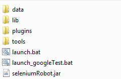

### 1 Import project ###
eclipse project file is provided to avoid eclipse project configuration
Import this project into eclipse.

In case eclipse does not weave aspects (.aj files do not have the 'A' icon), check in build path parameters that **/*.aj files are included to "sources on build path)

### 2 Build ###
Create build (for core and test apps):

	mvn clean package

Build creates a file named seleniumBot-core.zip. 

### 3 Test ###
SeleniumRobot contains Unit tests, executed through the maven "test" phase. They tend to be quick and do not use any browser. They are configured using the `data/core/testng/tu.xml` file.

Integration tests are executed in the maven "verify" phase. They are configured using the `data/core/testng/ti.xml` file. These tests can start browser to check specific features.

### 4 Deploy ###
Unzip this file to any folder.

Also unzip the test app and you should get this folder structure:

### 5 Release code ###
When a SNAPSHOT version is ready to be released, use

    mvn release:prepare release:perform

Check installation requirements to perform a release