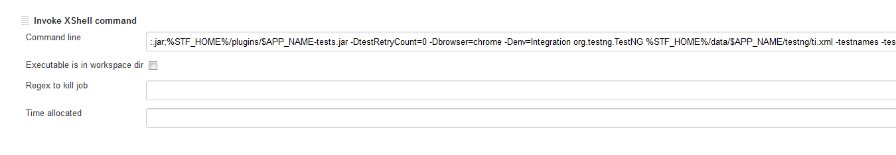
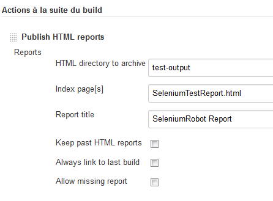
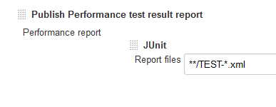
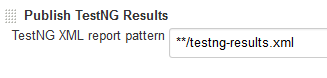
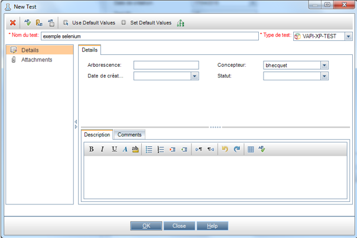
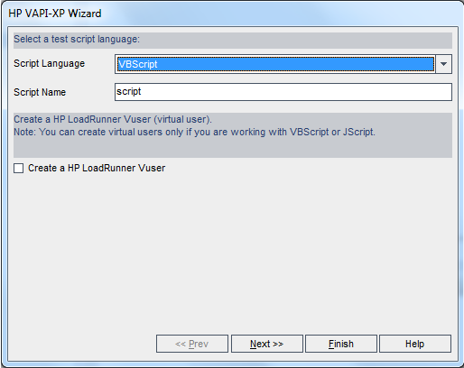
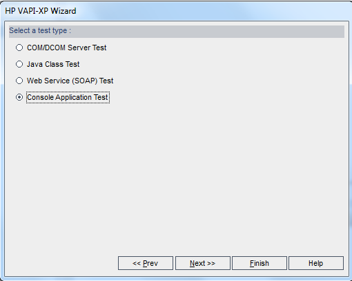
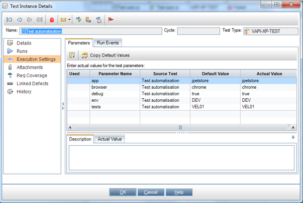
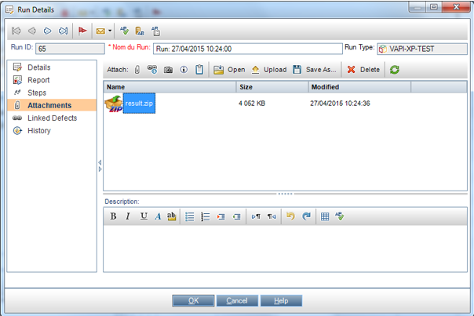

<!-- START doctoc generated TOC please keep comment here to allow auto update -->
<!-- DON'T EDIT THIS SECTION, INSTEAD RE-RUN doctoc TO UPDATE -->
**Table of Contents**

- [0 SeleniumRobot Server](#0-seleniumrobot-server)
- [Test managers](#test-managers)
  - [1 Jenkins](#1-jenkins)
  - [2 Squash TM through API](#2-squash-tm-through-api)
    - [Enable Squash TM usage](#enable-squash-tm-usage)
    - [Configure Test to be linked with Squash TM](#configure-test-to-be-linked-with-squash-tm)
      - [Configure through annotation](#configure-through-annotation)
      - [Configure through context](#configure-through-context)
    - [Configure campaign name, campaign folder and iteration](#configure-campaign-name-campaign-folder-and-iteration)
  - [4 HP ALM](#4-hp-alm)
    - [Configure environment to access HP ALM](#configure-environment-to-access-hp-alm)
    - [Configure test runner computer](#configure-test-runner-computer)
    - [Create test on ALM](#create-test-on-alm)
    - [Test script](#test-script)
    - [test parameters](#test-parameters)
    - [Run test](#run-test)
- [Bugtrackers](#bugtrackers)
  - [0 Disable bug creation for a specific step](#0-disable-bug-creation-for-a-specific-step)
  - [1 Jira](#1-jira)
    - [Configuration](#configuration)
    - [Find required fields and allowed values](#find-required-fields-and-allowed-values)

<!-- END doctoc generated TOC please keep comment here to allow auto update -->

## 0 SeleniumRobot Server ##
SeleniumRobot server [https://github.com/bhecquet/seleniumRobot-server](https://github.com/bhecquet/seleniumRobot-server) is a server which aims to be used with SeleniumRobot, giving the following features:
- handle test variables: instead of setting test data into env.ini file, they can be set in server, which offers more features when sharing values among test projects
- compare snapshots: as Seleniumrobot takes snapshots, it's able to send them to server which can compare with the same step of the same test executed previously
- record test results: Even if test results are recorded in a test manager, the full result format with snapshots may not be available directly

To use this server, 
- first deploy it (see documentation of seleniumRobot-server project)
- create test application, environment on server
- create application version. This is the same version as `major.minor` version in your pom.xml. SeleniumRobot may create it automatically on start
- populate test variables with the one you placed in env.ini file.
- set a JVM parameter `seleniumRobotServerUrl` when starting the test, giving the root url of the server. E.g: `http://seleniumRobotServer:8000`. This can be replaced by a parameter inside XML testNG file
- parameter `seleniumRobotServerActive` must be set to true. By default, only variable fetching is done when server is active
- parameter `seleniumRobotServerCompareSnapshots` can be set to true for tests where snapshot comparison is required (defaults to false)
- parameter `seleniumRobotServerRecordResults` can be set to true when results should be recorded on server (defaults to false)
- run your tests. SeleniumRobot will automatically connect to server and send data

## Test managers ##

Test manager are softwares that help managing test campaigns, requirements and tests results. For selenium test, the aim is to execute selenium test instead of manual tests and record results

### 1 Jenkins ###

To execute SeleniumRobot using Jenkins, create a free-style job.

- In "Build" section, add a shell command: `${JENKINS_HOME}/tools/hudson.tasks.Maven_MavenInstallation/Maven_3/bin/mvn -U org.apache.maven.plugins:maven-dependency-plugin:2.8:unpack -Dartifact=com.infotel.seleniumRobot:core:RELEASE:zip -DoutputDirectory=${WORKSPACE}/tmp/seleniumRobot  -Dmdep.overWriteReleases=true`<br/>
This command will update core artifact to the latest version on maven
- In "Build" section, add a shell command: `${JENKINS_HOME}/tools/hudson.tasks.Maven_MavenInstallation/Maven_3/bin/mvn -gs ${MVN_SETTINGS} -U org.apache.maven.plugins:maven-dependency-plugin:2.8:unpack -Dartifact=<groupId>:<artifactId>:RELEASE:zip -DoutputDirectory=${WORKSPACE}/tmp/seleniumRobot  -Dmdep.overWriteReleases=true`<br/>
This command will update the test application to its latest release from maven repo
	- Replace `<groupId>` by the groupId of your test application artifact
	- Replace `<artifactId>` by the artifactId of your test application

- In "Build" section, add a shell command: `java -cp <sr_home>/seleniumRobot.jar;<sr_home>/plugins/<app_name>-tests.jar -DtestRetryCount=0 -Dbrowser=chrome -Denv=Integration org.testng.TestNG %STF_HOME%/data/<app_name>/testng/<testng.xml> -testnames <testnames>`<br/>
  - Replace `<sr_home>` by the folder where seleniumRobot is deployed
  - Replace `<app_name>` by the name of the test application. e.g 'jpetstore'
  - Replace `<testng.xml>` by the XML file to execute
  - Replace `<testnames>` by the names of tests to execute (they must be present in XML file)
  

- In "Post build actions", configure like this<br/>
  

  

  
  
SeleniumRobot uses external fonts and javascript so Jenkins must be configured to relax CSP (Content-Security-policy) if it's acceptable to you: [https://wiki.jenkins.io/display/JENKINS/Configuring+Content+Security+Policy] (https://wiki.jenkins.io/display/JENKINS/Configuring+Content+Security+Policy)

e.g: `"default-src 'self' fonts.googleapis.com cdnjs.cloudflare.com fonts.gstatic.com 'unsafe-inline' 'unsafe-eval'"`

### 2 Squash TM through API ###

As of Squash TM 1.21, API is complete enough to allow to create campaigns, iteration, test results directly from it. So it's possible to execute a test from Jenkins and have the results directly sent to Squash TM

#### Enable Squash TM usage ####

Use parameters:

- `tmsType` => 'squash'
- `tmsUrl` => url of squash server. (e.g: http://localhost:8080/squash)
- `tmsUser` => user to connect 
- `tmsPassword` => password used to connect
- `tmsProject`=> project to which these tests belong

#### Configure Test to be linked with Squash TM ####

By default, test result won't be sent to Squash TM even if it's properly configured.
For this link to be active, we MUST give seleniumRobot the 'id' of the test in Squash

Test id can be found when clicking on any test, the url is of type: 'https://<host>/squash/test-case-workspace/test-case/499831/content'. Test id is '499831'

When you have this id, configure your java test

##### Configure through annotation #####

In most case, Test id can be configured as a parameter of @Test annotation

```java
@Test(attributes = {@CustomAttribute(name = "testId", values = "12")})
public void testMyFeature() {
	...
}
```

##### Configure through context #####

In case of DataProvider, this is not possible to use the annotation, as testId would be the same for all datasets.
So, to provide a test id for each dataset, configure this way

```
@Test(groups={"ut"})
    public void testTestCaseIdFromContext() {
        robotConfig().testManager().setTestId(23);
        ...
        
    }
```

This is equivalent of setting a variable `tms.testId`

#### Configure campaign name, campaign folder and iteration ####

By default, a campaign "Selenium <context name>" and an iteration "<application version>" are used to record test results in squash
You can override this beheviour by specifying it in variables or in test directly

```
@Test(groups={"ut"})
    public void testTestCaseIdFromContext() {
        robotConfig().testManager().setCampaignName("my campaign");
        robotConfig().testManager().setIterationName("my iteration");
        robotConfig().testManager().setCampaignFolderPath("folder1/folder2");
        ...
        
    }
```

It's also possible to set it via variables:
`tms.squash.iteration`
`tms.squash.campaign`
`tms.squash.campaign.folder`

  
### 4 HP ALM ###
 
From ALM v11 HP ALM can run seleniumRobot tests using VBScript connector

**WARNING**: This connector is not currently fully fonctional as launch_SeleniumRobot.bat script does not exist anymore
VBS script should be updated, for example, using a direct java call with JVM options and TestNG parameters clearly identified

#### Configure environment to access HP ALM ####

- `tmsType` => 'hp'
- `tmsUrl` => url of ALM server. (e.g: http://myamlserver:8080)
- `tmsUser` => user to connect 
- `tmsPassword` => password used to connect
- `tmsProject`=> project to which these tests belong
- `tmsDomain` => Domain of the project
- `tmsRun` => id of the current run


This paramater is common to all tests and can be written in TestNG XML file or in a common configuration file loaded by TestNG XML file (param `testConfig`) 

Run information (specific to test running) must be put in `tmsRun`

 
#### Configure test runner computer ####
 
Create `SELENIUMROBOT_HOME` environment variable, pointing to the path where robot is available (unzipped, presence of launch.bat file)
 
#### Create test on ALM ####
 
In ALM, create a VAPI-XP test



Click 'OK'



Keep 'VBSCript' and click 'Next'



Choose 'Console application' and click 'Finish'

#### Test script ####

In Test plan, go to newly created test, "Test script" tab and paste the following content
 	

	' ----------------------------------------------------
	' Main Test Function
	' Debug - Boolean. Equals to false if running in [Test Mode] : reporting to Quality Center
	' CurrentTestSet - [OTA COM Library].TestSet.
	' CurrentTSTest - [OTA COM Library].TSTest.
	' CurrentRun - [OTA COM Library].Run.
	' ----------------------------------------------------
	Sub Test_Main(Debug, CurrentTestSet, CurrentTSTest, CurrentRun)
	  ' *** VBScript Limitation ! ***
	  ' "On Error Resume Next" statement suppresses run-time script errors.
	  ' To handle run-time error in a right way, you need to put "If Err.Number <> 0 Then"
	  ' after each line of code that can cause such a run-time error.
	  On Error Resume Next
	
	  ' clear output window
	  TDOutput.Clear
	
	  seleniumRobotHome = CreateObject( "WScript.Shell" ).Environment( "SYSTEM" )("SELENIUMROBOT_HOME") & "\launch_seleniumRobot.bat"
	  
	  options = ""
	  With CurrentTSTest.Params
	    For i = 0 To .Count - 1
	      options = options & "-D" & Trim(.ParamName(i)) & "=" & .ParamValue(i) & " "
	    Next
	  End With
	
	
	  ' Run seleniumBot application
	  result = XTools.run(seleniumRobotHome , options & " -DtmsRun={'type':'hp','run':" & CurrentRun.ID & "}", -1)
	
	  If Err.Number <> 0 Or result <> 0 Then
	    TDOutput.Print "Run-time error [" & Err.Number & "] : " & Err.Description
	    ' update execution status in "Test" mode
	    If Not Debug Then
	      CurrentRun.Status = "Failed"
	      CurrentTSTest.Status = "Failed"
	    End If
	  End If
	End Sub
	
#### test parameters ####
	
In 'parameters' tab, add specific test parameters 


#### Run test ####

In test lab, create a test set with this automated test. Double click test instance and configure "execution settings"



Test run is possible when actual values are configured. You can use "copy default values" if they are correct. When test finishes, robot records test details as a test attachment



## Bugtrackers ##

Bugtrackers will store issues when a selenium test fails.
If the issue already exists for this failing test, it's not recreated.
If the issue exists and the test becomes sucessful, then issue is closed

### 0 Disable bug creation for a specific step ###

By default, all failing tests will be logged in bugtracker if this one is configured. For some reason, you may not want a bug to be created if a particular step fails (e.g: a teardown step, a configuration step, ...)
In this case, you can annotate this step

		@Step(disableBugtracker=true)
		public SignIn checkout() throws Exception {
			proceed.click();
			return new SignIn(); 
		}

If the test fails at this step no bug will be created, but the test will still fail at this point

### 1 Jira ###

#### Configuration ####

Many parameters drive the use of jira because this software is highly configurable

typical / minimal configuration would be

```
	# common bugtracker options
	-DbugtrackerUrl=https://my.jira.server/jira
	-DbugtrackerUser=myUser
	-DbugtrackerPassword=myPassword
	-DbugtrackerProject=PROJECTKEY
	-DbugtrackerType=jira
	
	# specific jira options
	-Dbugtracker.priority=Important				# name of the priority to set to issue
	-Dbugtracker.jira.issueType=Bug				# name of the issue type, as stated in GUI
	-Dbugtracker.jira.openStates=Open,Todo	# name of states that say the issue is not closed. It depends on the workflow
	-Dbugtracker.jira.closeTransition=Done	# name of the transition to go to "closed" state. 
```
Many transitions may be defined so that several steps of the workflow can be run through.
for example: `To Analyze/To resolve/Resolve`
SeleniumRobot will look for the current available transition of the issue and then run through all the remaining ones.
**Configured user MUST have the rights to perform transitions on projet. Else, you will get the following error**
`Error generating report
com.seleniumtests.customexception.ConfigurationException: 'bugtracker.jira.closeTransition' values [xxx/yyy] are unknown for this issue, allowed transitions are []`


Depending on jira project, you may need to specify additional options if the fields (components and custom fields) are mandatory

```
	-Dbugtracker.jira.components=Component1
	-Dbugtracker.reporter=<reporter>
	-Dbugtracker.assignee=<assignee>
	-Dbugtracker.jira.field.myFieldName1=myFieldValue1		# myFieldName is the name of the custom field as defined in GUI
	-Dbugtracker.jira.field.myFieldName1=myFieldValue1
```

**All these options can also be set in XML file / ini file / seleniumRobot server**
You'd better set
- in XML  (because they depend on project and will never change): `bugtrackerProject`, `bugtracker.priority`, `bugtracker.jira.<any>`, `bugtracker.reporter`, `bugtracker.assignee`
- in seleniumRobot server (because they are common to all projects): `bugtrackerUrl`, `bugtrackerUser`, `bugtrackerPassword`
- in command line (because you can decide on each test launch whether to use Jira, and **it will not be searched in .ini or seleniumRobot server**): `bugtrackerType`

#### Find required fields and allowed values ####

As it's not always easy to find which values to set to the issue, you can execute the class com.seleniumtests.connectors.bugtracker.jira.JiraConnector with the following arguments: `java -cp ... com.seleniumtests.connectors.bugtracker.jira.JiraConnector <jiraUrl> <projectKey> <user> <password> <issueType>`
It will print all required fields with allowed values if applicable
