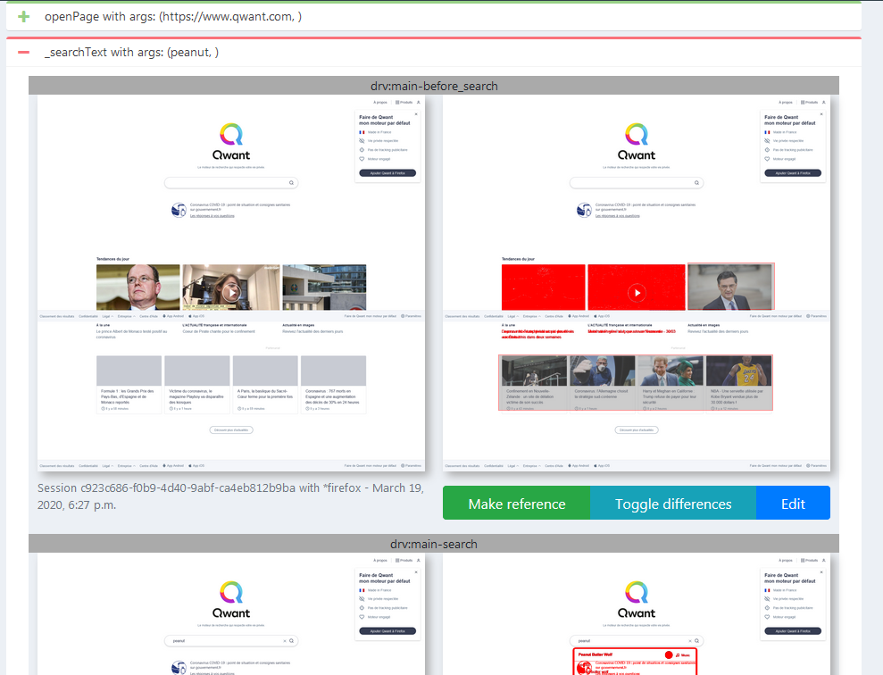
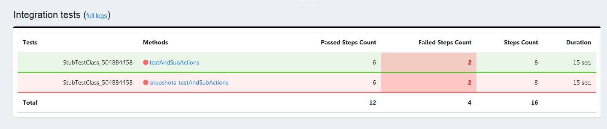

<!-- START doctoc generated TOC please keep comment here to allow auto update -->
<!-- DON'T EDIT THIS SECTION, INSTEAD RE-RUN doctoc TO UPDATE -->
**Table of Contents**

- [0 Troubleshooting](#0-troubleshooting)
  - [Clicking on an element makes a new window display but browser returns to previous one](#clicking-on-an-element-makes-a-new-window-display-but-browser-returns-to-previous-one)
- [1 Compare 2 XML files](#1-compare-2-xml-files)
- [2 Write working unit tests](#2-write-working-unit-tests)
- [3 Core: making an action on an HTMLElement replay on error](#3-core-making-an-action-on-an-htmlelement-replay-on-error)
- [4 Working with images](#4-working-with-images)
  - [Using PictureElement](#using-pictureelement)
  - [Using ScreenZone](#using-screenzone)
  - [Check if image is matching](#check-if-image-is-matching)
- [5 Working with PDF files](#5-working-with-pdf-files)
- [6 Accessing remote computer through SSH or SCP](#6-accessing-remote-computer-through-ssh-or-scp)
- [7 execute requests via SOAP UI](#7-execute-requests-via-soap-ui)
- [8 Using database](#8-using-database)
- [9 Using emails](#9-using-emails)
  - [9.1 Getting email](#91-getting-email)
  - [9.2 Writing email](#92-writing-email)
- [10 upload file](#10-upload-file)
  - [The selenium way (preferred)](#the-selenium-way-preferred)
  - [The selenium robot way (if previous method is not possible)](#the-selenium-robot-way-if-previous-method-is-not-possible)
- [11 Write custom reports](#11-write-custom-reports)
  - [available data in test report](#available-data-in-test-report)
  - [available data in summary report](#available-data-in-summary-report)
- [12 Monitor error level](#12-monitor-error-level)
- [13 Access remote servers through HTTPS](#13-access-remote-servers-through-https)
- [14 Inheritance between test applications](#14-inheritance-between-test-applications)
- [15 Record network traffic](#15-record-network-traffic)
- [16 Use Neoload tool to design and record End User Experience](#16-use-neoload-tool-to-design-and-record-end-user-experience)
  - [Design mode](#design-mode)
  - [End User Experience](#end-user-experience)
- [17 Add extension to the browser](#17-add-extension-to-the-browser)
- [18 Add current date in test-output folder](#18-add-current-date-in-test-output-folder)
  - [for windows](#for-windows)
- [19 Create a custom reporter](#19-create-a-custom-reporter)
- [20 Debug running test](#20-debug-running-test)
- [21 Customize driver behaviour](#21-customize-driver-behaviour)
- [22 Automate Salesforce lightning UI](#22-automate-salesforce-lightning-ui)
- [23 Compare snapshots](#23-compare-snapshots)
  - [Images are not fully loaded on resulting capture](#images-are-not-fully-loaded-on-resulting-capture)
  - [Limitations](#limitations)
    - [Step name](#step-name)
- [24 Activate Dark Mode (chrome only)](#24-activate-dark-mode-chrome-only)
- [25 Execute UFT test](#25-execute-uft-test)
- [26 Read XLSX file](#26-read-xlsx-file)
- [27 Perform accessibility testing (WCAG) using Axe-core](#27-perform-accessibility-testing-wcag-using-axe-core)
- [28 Generate One-time password](#28-generate-one-time-password)
- [29 Execute lighthouse on your webpage](#29-execute-lighthouse-on-your-webpage)
- [30 read PDF files](#30-read-pdf-files)
- [31 set chrome / edge geolocation](#31-set-chrome--edge-geolocation)

<!-- END doctoc generated TOC please keep comment here to allow auto update -->

In this section, we will describe how to add some useful features to test applications (file comparison, log reading, ...)

### 0 Troubleshooting ###

#### Clicking on an element makes a new window display but browser returns to previous one ####

This behaviour is caused by seleniumRobot when doing the following

```java
	testPage.link.click();
	
	// this is the PageObject corresponding to the new window
	DriverSubTestPage subTestPage = new DriverSubTestPage(false);
	
	// go to new opened window
	mainHandle = testPage.selectNewWindow();
```
	
The call to new PageObject is performing snapshot of the current window. But, driver did not already switched to this window so 
snapshot is taken from the first one.

To resolve, do instead

```java
	testPage.link.click();
	
	// go to new opened window
	mainHandle = testPage.selectNewWindow();
	
	// this is the PageObject corresponding to the new window
	DriverSubTestPage subTestPage = new DriverSubTestPage(false);
```

### 1 Compare 2 XML files ###
Use the XMLUnit api: https://github.com/xmlunit/user-guide/wiki

Add dependency to pom.xml
	
```xml
	<dependency>
		<groupId>org.xmlunit</groupId>
		<artifactId>xmlunit-core</artifactId>
		<version>2.2.1</version>
	</dependency>
```
	
Use the following java code
	
```java
	Source source = Input.fromStream(getClass().getResourceAsStream("/tu/xmlFileToTest.xml")).build();
    Source source2 = Input.fromStream(getClass().getResourceAsStream("/tu/xmlFileToTest2.xml")).build();
    Diff diff = DiffBuilder.compare(source).withTest(source2).build();
    System.out.println(diff);
```
    
### 2 Write working unit tests ###
By default, SeleniumTestsContext enables SoftAssertions, so any unit test with assertion failure will not really fail. To prevent this behaviour, subclass all Unit-Test class from 

- `GenericTest` : parent class for all unit tests
- `GenericDriverTest`: parent class for real driver tests. It cleans driver after each test
- `MockitoTest`: parent of all tests using Mockito / PowerMock

depending on test type

If you need to reinit the SeleniumTestContext using `SeleniumTestsContextManager.initThreadContext(testNGCtx)`, call `initThreadContext(testNGCtx)` of one of these classes instead

### 3 Core: making an action on an HTMLElement replay on error ###

By default, actions in HtmlElements are done only once.<br/>
For better reliability, all actions currently implemented in SeleniumRobot are made to retry on error

```java
    @ReplayOnError
    public void click() {
        findElement(true);
        element.click();   
    }
```
    
/!\ *annotate only direct actions (where no other HtmlElement method, except `findElement` is called)

### 4 Working with images ###

SeleniumRobot exposes 3 elements to work with images

- `ImageElement` is used to handle HTML images `` element will be used. This may cause problem if you are in a page where no body is present.
In this case, provide an other top level element. 

`PictureElement` and `ScreenZone` accept a `detectionThreshold` which defaults to 0.1. It represents the detector sensibility. A low value means detector will be quite strict when searching image.

**/!\**: resource name is case-sensitive. It may not be obvious in IntelliJ, but with standart execution, if the resource name you provide and its name in src/test/resources is not exactly the same, you will get a `class java.lang.ExceptionInInitializerError: null` or `class java.lang.NoClassDefFoundError: Could not initialize class` when creating the PictureElement

**/!\**: `OpenCV Error: Assertion failed (corrsize.height <= img.rows + templ.rows - 1 && corrsize.width <= img.cols + templ.cols - 1) in cv::crossCorr` is raised when wrong format is used for picture to detect (e.g: GIF instead of PNG, cf issue #269)

#### Using PictureElement ####

Search for picture in browser, without the need to scroll down and click on it. It will then search for the "body" element. If you search the picture inside a frame, and main document has no "body" tag, then you should specify an element inside frame, or the frame itself

```java
	PictureElement googlePicture = new PictureElement("picture", "tu/googleSearch.png", null);
	googlePicture.click()
```
	
or search for picture (physically located inside src/test/resources/tu/images/logo_text_field.png) in browser, being placed after the table element and click on it

```java
	Table table = new Table("table", By.id("table"));
	PictureElement picture = new PictureElement("picture", "tu/images/logo_text_field.png", table);
	picture.click()
```
	
or search for picture (physically located inside /data/<application>/images/googleSearch.png)  in browser and click on it. No scrolling will be performed

```java
	PictureElement googlePictureWithFile = new PictureElement("picture", Paths.get(SeleniumTestsContextManager.getApplicationDataPath(), "images", "googleSearch.png").toFile(), null);
	googlePictureWithFile.click()
```

#### Using ScreenZone ####

ScreenZone represents the computer desktop

Search for picture (physically located inside src/test/resources/tu/googleSearch.png) on desktop and click on it

```java
	ScreenZone googleForDesktop = new ScreenZone("picture", "tu/googleSearch.png");
	googleForDesktop.click();
```
	
or interract with desktop directly without specifying a picture. Thus, click coordinates will be absolute ones

```java
	new ScreenZone("image").clickAt(rectangle.x + 10, rectangle.y + 10);
```
	
or send text

```java
	ScreenZone firefoxForDesktop = new ScreenZone("picture", "tu/images/logo_text_field.png");
	firefoxForDesktop.sendKeys("hello", 0, 40);
```
	
or send keys (will write "ab")

```java
	ScreenZone firefoxForDesktop = new ScreenZone("picture", "tu/images/logo_text_field.png");
	firefoxForDesktop.sendKeys(0, 40, KeyEvent.VK_A, KeyEvent.VK_B);
```
	
#### Check if image is matching ####

`java -cp seleniumRobot.jar com.seleniumtests.util.imaging.ImageDetector <scene_file_path> <object_to_detect_file_path> <threshold=0.1>`

### 5 Working with PDF files ###

Sometimes, it's useful to read PDF files and extract content. Formatting is lost but text remains using the following code

```java
	PDDocument document = PDDocument.load(fichierPdf);
	if (document.isEncrypted()) {
		document.decrypt("");
	}
	document.setAllSecurityToBeRemoved(true);
	PDFTextStripper s = new PDFTextStripper();
	s.getText(document);
```
			
PDDocument is available through maven dependencies

```xml
	<dependency>
        <groupId>org.apache.pdfbox</groupId>
        <artifactId>pdfbox</artifactId> 
        <version>1.8.9</version>
    </dependency>
    <dependency>
        <groupId>org.bouncycastle</groupId>
        <artifactId>bcmail-jdk15</artifactId> 
        <version>1.44</version>
    </dependency> 
    <dependency>
        <groupId>org.bouncycastle</groupId>
        <artifactId>bcprov-jdk15</artifactId> 
        <version>1.44</version>
    </dependency>
```
    
### 6 Accessing remote computer through SSH or SCP ###

To retrieve file from remote to local

```java
	Scp scp = new Scp(<sshHost>, <sshUser>, <sshPassword>, null, false);
	scp.connect();  
	scp.transfertFile(new File(<remote file>), new File(<local file>));
	scp.disconnect();
```
	
To execute command on remte

```java
	Ssh ssh = new Ssh(<sshHost>, <sshUser>, <sshPassword>, null, false);
	ssh.connect();  
	ssh.executeCommand(<my command>);
	ssh.disconnect();
```
	
### 7 execute requests via SOAP UI ###

When someone already created SOAP UI request to test a service, reuse can be time saving
Either use directly the project file, or change content to adapt it to your data set or environment and execute project string

```java
	SoapUi soapUi = new SoapUi();
	String reply = soapUi.executeWithProjectString(<project_content>, "myProject");
```

Alternatively, you would use Unirest, which is already provided by SeleniumRobot [http://kong.github.io/unirest-java/](http://kong.github.io/unirest-java/)
		
### 8 Using database ###

For now, only Oracle database is supported
You must provide the ojdb6.jar file into src/lib folder so that it can be automatically installed in maven local repository when doing `mvn clean`
connection and disconnection are done automatically

```java
	Oracle db = new Oracle(<dbName>, <dbHost>, <dbPort>, <dbUser>, <dbPassword>);
	db.executeParamQuery("SELECT * FROM TAB1 WHERE id=?", id);
```
	
or

```java
	Oracle db = new Oracle(<dbName>, <dbUser>, <dbPassword>, <tnsNamesPath>);
	db.executeParamQuery("SELECT * FROM TAB1 WHERE id=?", id);
```
	
### 9 Using emails ###

#### 9.1 Getting email ####

SeleniumRobot provides several email clients to allow reading email content and attachments

```java
	EmailAccount account = new EmailAccount(<email_address>, <login>, <password>, <emailServer>);
	...
	some actions that send an email
	...
	Email emailFound = account.checkEmailPresence(<email_title>, new String[] {"attachment1"});
```
	
Email title and attachment names can be regular expression as String.matches() is used to search for the right emails
**WARN** create your email server connection before email is sent so that `checkEmailPresence` can look at the last received emails (it keeps an index on already seen mails)
	
emailServer is an object created by 

```java
	EmailServer server = new EmailServer("<mail_server_urs>", EmailServerTypes.EXCHANGE_EWS, "<domain_for_user>");
```
	
Using variables, it's also possible to write:

```java
	EmailAccount emailAccount = EmailAccount.fromJson(param("emailAccount"));
	emailAccount.setEmailServer(EmailServer.fromJson(param("emailServer")));
```
	
where `emailAccount` is `{'email': 'mymail@compmail.com', 'login': 'login', 'password': 'passwd'}` and `emailServer` is `	{'url': 'msg.compmail.com', 'type': 'EXCHANGE_EWS', 'domain': 'compmail.com'}`

#### 9.2 Writing email ####

To write an email for exchange server (the only one supported): 

```java
	EmailServer server = new EmailServer("<mail_server_urs>", EmailServerTypes.EXCHANGE_EWS, "<domain_for_user>");
	EmailAccount account = new EmailAccount(<email_address>, <login>, <password>, <emailServer>);
	account.sendMessage(Arrays.asList("myaddress@mydomain.com"), "hello", "hello");
```
	
### 10 upload file ###

This should be avoided as much as possible, but some tests may require uploading a file to the tested application.

#### The selenium way (preferred) ####
This is the most reliable way as it's provided by selenium driver.

Conditions are:
- you have an `<input type="file" id="uploadFile" />` element
- this element is visible (not hidden by an other one)

Then, you can do either (the later is advised):
- `driver.findElement(By.id("uploadFile")).sendKeys(<some file path>);`
- `new FileUploadElement("upload", By.id("uploadFile")).sendKeys(<some file path);`

Selenium will do the rest for you, locally or in grid mode

#### The selenium robot way (if previous method is not possible) ####

This may happen if the button / text field on which you click to upload is not an `input` element of type `file`

Inside your PageObject:
- With selenium, click on the button to upload the file
- then you can call `uploadFile(<filePath>)` inside your PageObject which will handle the modal opened by browser.

The drawback of this method is that browser MUST have the focus and thus no other test should be executed at the same time because we are sending keyboard actions outside of selenium

### 11 Write custom reports ###

Through `customTestReports` and `customSummaryReports`, you can add or replace some of the reports SeleniumRobot generates

Option is a comma seperated list of `<prefix>::<extension>::<template_file located in resources>`.
Template file has the Velocity format and must be located in any of the resources seleniumRobot can access (those from test application or from core)

#### available data in test report ####

One file is generated for each test. Name is `<prefix>-<classname>.<methodName>.<extension>`

- `errors`: number of steps in error in test
- `failures`: number of steps in failure in test
- `hostname`: host running the test
- `suiteName`: name of the test method
- `className`: class where method is located
- `tests`: number of steps
- `duration`: overall duration of test
- `time`: start time of the test
- `testSteps`: list of TestStep objects. see javadoc for details	
- `browser`: browser used for test
- `logs`: logs in raw format (content of seleniumRobot.log file)  

#### available data in summary report ####

One file is generated for the overall session. Name is `<prefix>.<extension>`

- `pass`: number of passed tests during session
- `fail`: number of failed tests during session
- `skip`: number of skip tests during session
- `total`: number of tests during session

### 12 Monitor error level ###

If you have a script file (shell / batch / ...), and want to know if test went wrong or not, you can look at error level `echo %errorlevel%` for batch and `$?` for shell

### 13 Access remote servers through HTTPS ###

When accessing remote server, you can use Unirest API which ease sending HTTP requests.
In case access to HTTPS is done inside a dependency, you may encounter problems with certificate chain (e.g: accessing an exchange server through EWS).
You then need to add the remote certificate to a truststore and give it to the JVM (which uses by default it's internal truststore ($JAVA_HOME$/jre/lib/security/cacerts)

To override the default truststore, use `-Djavax.net.ssl.trustStore=<path_to_truststore>`

To debug, use `-Djavax.net.debug=ssl` 

### 14 Inheritance between test applications ###

Originally, a test application corresponds to a full web or mobile application. But if your application is big, or can easily be split into parts that have a few things in common, you can create several test application which will be easier to maintain. E.g: an application with a front-office and a back-office.
You can split a big test application into several ones

	parent-app (generic features)
		|--- child-app1 (app1)
		|--- child-app2 (app2)
		
**Beware**:
- each test application MUST contain all variables of the generic features it uses
- when executing test outside your IDE, classpath MUST contain the test application jar and the parent one: `java -cp seleniumRobot.jar;plugins/<app>-tests.jar;plugins/<parent-app>-tests.jar;lib/drivers/* -D<option1>=<value1> -D<option2>=<value2> org.testng.TestNG <path_to_TestNG_xml_file>"`

pom.xml of each child application will declare the parent-app as dependency, not the core, which is held by parent-app.
	  
### 15 Record network traffic ###

Developpers sometimes use network traffic monitor inside browsers to debug display errors (latency, ...)
For debugging test, this can also be helpful so you can activate network capture by setting the `captureNetwork` parameter to `true` when launching test
Then, an HAR file is recorded.

**INFO**: Network capture is only available with DIRECT and MANUAL proxy settings. Other settings are forbidden because the recording proxy cannot know the address and port of your corporate proxy in automatic mode

**WARN**: If using manual steps with network capture, beware that test steps are only recorded once the driver is created. This means that with the code below, step "Write" will not be displayed in HAR capture. Traffic will still be recorded in the init step (named with the test name). Driver is created with the call to `new DriverTestPage(true)`.
	
```java
	addStep("Write");
	DriverTestPage page = new DriverTestPage(true)
		._writeSomething();
	addStep("Reset");
	page._reset();
```
	  
### 16 Use Neoload tool to design and record End User Experience ###

Neoload is a tool that performs load testing on application. It also interfaces with Selenium to record test session timing using a real browser
Official documentation is there: [https://www.neotys.com/documents/doc/neoload/latest/en/html/#24373.htm](https://www.neotys.com/documents/doc/neoload/latest/en/html/#24373.htm)

Selenium can be used for 2 purposes: create project details from a browsing session (design mode) and measure browsing session timing (End User Experience)

#### Design mode ####
	  
To enable Design mode, you have to add `-Dnl.selenium.proxy.mode=Design` to the options given to SeleniumRobot. Moreover, add the option `-DneoloadUserPath=<userPath>` so that design mode is active. UserPath is the name of the scenario being recorded

In this mode, driver is configured with a proxy pointing to the neoload API (localhost:8090 by default). Other design API URL can be configured with option `-Dnl.design.api.url=<URL>`. see Configuration options [here](https://www.neotys.com/documents/doc/neoload/latest/en/html/#8278.htm) .
<br/>
So any other configured proxy will be overridden (BrowsermobProxy or manual proxy settings). If you need to go through a proxy for your tests (e.g: a corporate proxy), this proxy needs to be set into Neoload itself.

For test to start, prerequisites are:
- Neoload is started somewhere
- if not local, option `-Dnl.design.api.url=<URL>` is set to the remote neoload instance
- remote neoload instance has a loaded project
- some licences are reserved to neoload instance

#### End User Experience ####

To enable End User Experience, you have to add `-Dnl.selenium.proxy.mode=EndUserExperience` and `-DneoloadUserPath=<userPath>`

Test MUST be started from Neoload itself, either through a java test script action or a command line action. Launching options are the same as for any other test launching. See chap4_Run_tests for details. .
	  
### 17 Add extension to the browser ###

It's possible to add extension to browser provided you have downloaded it and it's located locally, or remotely through http/s server.
Example: `-Dextension0.path=http://localhost:8000/myExt.crx -Dextension0.options="key=value"`

Options are only supported for Firefox.

To download extension file, you can:
- on chrome, use the "Get CRX" extension
- on firefox, go to addons.mozilla.org, search your extension and right click on "add to firefox" button. It will give you the extension path
	  
	  
### 18 Add current date in test-output folder

#### for windows ####

    for /f %%a in ('powershell -Command "Get-Date -format yyyy_MM_dd__HH_mm_ss"') do set datetime=%%a
	
and then, in command line

    -DoutputDirectory=test-output_%datetime%
 	
### 19 Create a custom reporter ###

For textual reports, you can look at §11 which uses Velocity template engine to generate summary and per test reports
For more complex reports (send errors to Jira, send results to Squash, ...), you can write a custom reporter which extends the `CommonReporter` class.

This way, you can scan test results and do some actions based on results. Look at `CustomReporter.java` for example
To enable this report, use parameter `-DreporterPluginClasses=my.reporter.CustomClass` 

example:

```java
public class CustomReportPlugin extends CommonReporter {

	/**
	* This method is called only once at the end of all test suites generation
	*/
	@Override
	public void generateReport(List<XmlSuite> xmlSuites, List<ISuite> suites, String outputDirectory) {
		try {
			FileUtils.writeStringToFile(Paths.get(outputDirectory, "customReport.txt").toFile(), "foo");
		} catch (IOException e) {
		}
	}

	/**
	* This method is called each time a test has been executed
	* @param resultSet			the map of results
	* @param outdir			where to write results
	* @param optimizeReport	should we optimize reports. For HTML reporter, it means that size would be reduced if 'true' 
	* @param finalGeneration	'true' if this report generation is done at the very end of all test suite execution
	*/
	@Override
	protected void generateReport(Map<ITestContext, Set<ITestResult>> resultSet, String outdir, boolean optimizeReport,
			boolean finalGeneration) {

	}

}
```
	  
### 20 Debug running test ###

For debugging a test, you can:
- use your IDE to stop at breakpoints. For development purpose only
- use -Ddebug=core: when test is executing outside of dev environment, you will get a log file with all details about which methods are running. It's very verbose
- use -Ddebug=driver: when something wrong happens with browser / driver (crashing, errors, ...), it will log driver and browser behaviour. Moreover, with this option, performance logs file (file containing chrome network events) is written, else, only HAR file is produced 
- use -Ddebug=gui: it will outline an element before clicking on it or when searching if it's displayed or present. As it slows down the test (250 ms for each outline), use it only for demo.
- use -Ddebug=network: it will enable download monitor for video

### 21 Customize driver behaviour ###

Selenium provides way to extend driver behaviour on some events (clicking, exception, ...) through implementation of WebDriverEventListener interface.
If you want, for example, do something special when an element is not found (to handle unattended alerts for example), 
- create a class implementing WebDriverEventListener. In the following example, we print "hello" if an unexpected alert occurs. Moreover, as actions are replayed by seleniumRobot, this will be harmless for the running scenario
- add this listener to seleniumRobot through option `webDriverListener`. For example, on command line, it will give: `-DwebDriverListener=com.company.tests.PopupListener`

```java
package com.company.tests;

import org.openqa.selenium.By;
import org.openqa.selenium.UnhandledAlertException;
import org.openqa.selenium.OutputType;
import org.openqa.selenium.WebDriver;
import org.openqa.selenium.WebDriverException;
import org.openqa.selenium.WebElement;
import org.openqa.selenium.support.events.WebDriverEventListener;

public class PopupListener implements WebDriverEventListener {

	@Override
	public void beforeAlertAccept(WebDriver driver) {
		// TODO Auto-generated method stub

	}

	@Override
	public void afterAlertAccept(WebDriver driver) {
		// TODO Auto-generated method stub

	}

	[...]


	@Override
	public void onException(Throwable throwable, WebDriver driver) {
		if (throwable instanceof UnhandledAlertException) {
			System.out.println("hello");
		}

	}


	

}
```


### 22 Automate Salesforce lightning UI ###

Salesforce UI is a bit complicated to automate. Spring 20 version added more complexity so, to help you writing script you can:

- use extensively `ByC.attribute()` selector which helps finding elements through any attribute because salesforce exposes generated id
- for combobox, use `SelectList` by pointing to the `<lightning-base-combobox>` element. This will help to interract with them, selecting by text, partial text, ... in one action.
- use `ByC.xTagname`, `ByC.xName` instead of `By.tagName` and `By.name` because, due to custom elements, selenium cannot directly sometimes access to child elements of shadowed ones. But going the xpath way (what xTagName and xName do) solves the problem.
- in case of real shadow DOM elements, then use ByC.shadow() to walk through the tree and then find your sub-element.
- use `new <whatever>Element("my element", By.tagName(""), HtmlElement.FIRST_VISIBLE)` instead of `new <whatever>Element("my element", By.tagName(""))`  because salesforce DOM sometimes contains a duplicate version of the visible page and getting the first element for a selector, as selenium does, may lead to an invisible element.  

### 23 Compare snapshots ###

Through seleniumRobot server, you can compare UI with a reference snapshot. 


To enable this feature you must:

- set `seleniumRobotServerActive` to `true`
- set `seleniumRobotServerUrl` to the URL of the seleniumRobot server
- set `seleniumRobotServerCompareSnapshots` to `true`
- (optional) set `snapshotComparisonResult` to `displayOnly`, `changeTestResult` or `addTestResult`
- (optional) set `snapshotScrollDelay` to a value > 0 (time in ms to wait for image loading before taking snapshot)

Then, inside your test scripts, you must add snapshots with

```java
capturePageSnapshot(<pic_name>, SnapshotCheckType.TRUE);
```
or

```java
captureElementSnapshot(<pic_name>, <myWebElement>, SnapshotCheckType.TRUE);
```
Only the snapshots taken this way will be sent to server.

This, way, a new tab will be added in HTML report, showing the comparison. 
By default, snapshot taken this way are kept 30 days. If you want a different duration, set the parameter `seleniumRobotServerSnapshotsTtl` to another value.

Parameter `snapshotComparisonResult` allow to control the way snapshot comparison influences test result

- `displayOnly` will add a `red` or `green` bullet (and color snapshot comparison tab) in HTML result. This is only an information
- `changeTestResult` will do same as `displayOnly` but also set test result to 'KO' if functional test is 'OK' but snapshot comparison is 'KO'
- `addTestResult` will add a new test result (in all reports, not only HTML) for storing snapshot comparison result. This result will be named 'snapshot-<test_name>'



Page and element snapshot can be customized to:

- exclude some elements from the comparison, for example, when part of the page changes for every test (a date, a picture, ...)

```java
HtmlElement news = new HtmlElement("news", By.className("v4_news_block"));
capturePageSnapshot("search", SnapshotCheckType.FULL.exclude(news.findElements()));
```
- allow tolerance in comparison if you cannot get stable results with full pixel comparison. You can ask for a comparison with at most x% of error

```java
captureElementSnapshot("result",  result, SnapshotCheckType.FULL.withThreshold(1.5));
```

#### Images are not fully loaded on resulting capture ####

On some browser (e.g: chrome), SeleniumRobot needs to scroll the page to rebuild the whole web page picture. 
Taking a screenshot is done like this:
- screenshot
- scroll down
- screenshot
- scroll down
...

When web site uses progressive loading of picture, they may not be loaded when browser takes screenshot.
To avoid this problem, you can set `snapshotScrollDelay` to, for example, '300' and see if it helps. 
Then the process of taking screenshot will be

- screenshot
- scroll down
- wait 300 ms
- screenshot
- scroll down
- wait 300 ms
...

This setting wil ldepend on you network capabilities and the size of the loaded pictures. It's a bit empiric.

**This setting only applies to snapshot that will be used for comparison**

#### Limitations ####

##### Step name #####

Snapshot comparison is done with the reference snapshot having the same (test suite, test case, environment, browser, test step, snapshot name) information.
If, for some reason, step name changes among executions, comparison will not be done.
This could happen if the step name is: `myStep with args (a_value, a_changing_token)`
If `a_changing_token` changes over time, then step will always have a different name.

To avoid this problem:
- do not provide your token as method parameter (as it is a secret, it should not be displayed), or name the parameter `pwd` or `password` which will mask the token value in step name.
- Or use the `@Step` annotation

### 24 Activate Dark Mode (chrome only) ###

This is done through options given to chrome: `-DchromeOptions="--force-dark-mode --enable-features=WebUIDarkMode"`

### 25 Execute UFT test ###

Generally, we should never have to try to mix test tools, but in rare cases, an end-to-end scenario needs using several pieces of software including browser and non-web application clients.
In this case UFT (Universal Functional Testing) may be used to automate the whole process (we probably should do this) but we d'ont always do what we should. So, in this case, SeleniumRobot can help

For a test stored on ALM

```
	Uft uft = loadUftScript("http://alm-server.company.com/qcbin", "user", "password", "domain", "project", "[QualityCenter]Subject\\Tools\\Tests\\test1", true);
	Map<String, String> args = new HashMap<>();
	args.put("User", "toto");
	executeUftScript(uft, 60, args);
```
You set a timeout to wait for UFT to complete its process. As it may be very slow, add overhead


For a test stored locally on computer executing the test

```
	Uft uft = loadUftScript("http://alm-server.company.com/qcbin", "user", "password", "domain", "project", "D:\\UFT\\Tests\\Tools\\Tests\\test1", true);
	Map<String, String> args = new HashMap<>();
	args.put("User", "toto");
	executeUftScript(uft, 60, args);
```

By default, starting UFT script will first close all uft.exe instances on the target computer. If you want to avoid that, call instead

```
Uft uft = loadUftScript("http://alm-server.company.com/qcbin", "user", "password", "domain", "project", "D:\\UFT\\Tests\\Tools\\Tests\\test1", false);
```

If you execute your tests wit seleniumRobot grid, the only thing to worry about is to start the web browser before executing UFT test (it will reserve a node). Else, no node will be available and it will fail. Moreover, you will need to allow "cscript.exe" to be executed from grid: 
Add `-extProgramWhiteList cscript.exe` to the grid node options

### 26 Read XLSX file ###

To read a single xlsx sheet
You get a list of row values
For each row, you get a map: columnName=cellValue

```
    File dataset = new File("myFile.xlsx");
    List<Map<String, String>> data = new ExcelHelper(dataset).readSheet(0, true);
```

To read all sheets at once
In this case, you obtain a map (one key for each sheet) whose values is a list of row values

```
    File dataset = new File("myFile.xlsx");
    Map<String, List<Map<String, String>>> data = new ExcelHelper(dataset).read(true);
```

### 27 Perform accessibility testing (WCAG) using Axe-core ###

Accessibility testing can be done using the axe-core library
Use WcagChecker class to analyze the current page.
If you do not provide elements (in the example below, myElement1, myElement2), the whole page will be analyzed

```
Results results = WcagChecker.analyze(driver, myElement1, myElement2);
```

If you do nothing else, the text report will be available in HTML report and number of violations will be provided as warning
But, you can also to some asserts on results object

### 28 Generate One-time password ###

For tests that need two factor authentication (like google authenticator), you can use

```
String code = Totp.generateCode("<your secret key>");
```

Secret key can be get as text from your login screen
For now, only 6 character length code are provided

Totp class also provides a "main" so that it's possible to generate a code, given the secret key, outside of selenium tests

### 29 Execute lighthouse on your webpage ###

Lighthouse is one of the chrome components that provides information about performance, accessibility, SEO ... [https://github.com/GoogleChrome/lighthouse](https://github.com/GoogleChrome/lighthouse)

To use it inside your tests, you first need to install lighthouse on the node on which browser will be started

```
npm install -g lighthouse
```

This should put a 'lighthouse' executable at the root of npm install path

If not the case (lighthouse installed without the '-g' flag), set the LIGHTHOUSE_HOME environment variable which points to the `<npm_install_folder>\node_modules\lighthouse\cli`

Then, in the test

```
    Lighthouse lighthouseInstance = LighthouseFactory.getInstance();
    lighthouseInstance.execute(page.getUrl(), new ArrayList<>());
    logger.logTestValue("accessibility", "accessibility", lighthouseInstance.getScore(Category.ACCESSIBILITY).toString()); 
```

You can also use some asserts to control scores

### 30 read PDF files ###

Simply call
```
new PDFReader(pdfFile).getText()
```

The tricky part is to get the PDF file, which is outside of this documentation

### 31 set chrome / edge geolocation ###

** This will only work if no policy prevent it **

Inside a test scenario, you can write

```
setGeolocation(25.0134, 54.564)
```

Or inside a page

```
driver.setGeolocation(25.0134, 54.564)
```