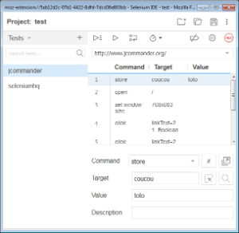
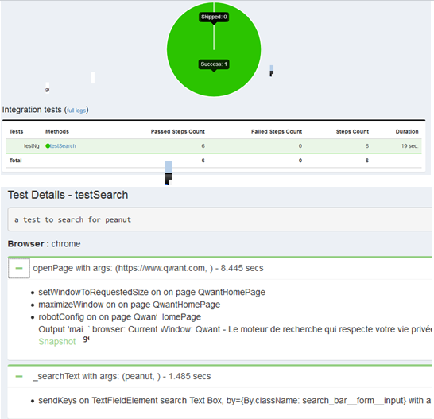
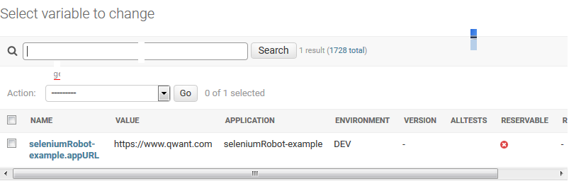

# What is SeleniumRobot #

SeleniumRobot is an other selenium testing framework that ease writing, execution and analysis of Selenium tests.
It's best used with https://github.com/bhecquet/seleniumRobot-grid which pushes all local seleniumRobot features to an improved selenium grid.

# Why you should use it #

Writing selenium tests is quite simple initially but requires some setup and improvements once you want your tests to be reliable and executed widely:

- replay on failure
- automatic waits
- code reuse
- configurable test data
- configurable browser
- ... 

Therefore, use of a selenium framework is mandatory. SeleniumRobot offers these features and much more

## Key Features ##

	
Multi-browser and Mobile ready

	

 

	

	
Able to execute selenium IDE scenarios  
	This will help creating tests script easily with the power of a real Selenium framework
 

	
Improved test robustness: 
	<ul>
		<li>Action replay until it succeeds or timeout occurs</li>
		<li>Scenario replay when technical error occurs (element not found)</li>
		<li>Automatic waiting for element presence</li>
		<li>Automatic scrolling so that Selenium does not complain about element not being visible</li>
		<li>Custom locators: by attribute, label, text, ... to avoid xpath locators and simplify maintenance</li>
	</ul>
	

	

 

	

	
Diagnose your tests easily  
		<ul>
			<li>Video capture</li>
			<li>screenshots</li>
			<li>logs executed actions</li>
			<li>custom reports</li>
		</ul>
	
 

	
Manage your test data per test environment 
	Use a simple .ini file for simple case or a centralize parameter server in order to:
		<ul>
			<li>store temp parameter for reuse in an other test</li>
			<li>share common parameters of your organization</li>
			<li>declare several values for the same variable (e.g: login) so that so that different tests use different values</li>
		</ul>
	

	

 

## Run your test massively with seleniumRobot grid ##

# Integrate with CI/CD #

# Example #
